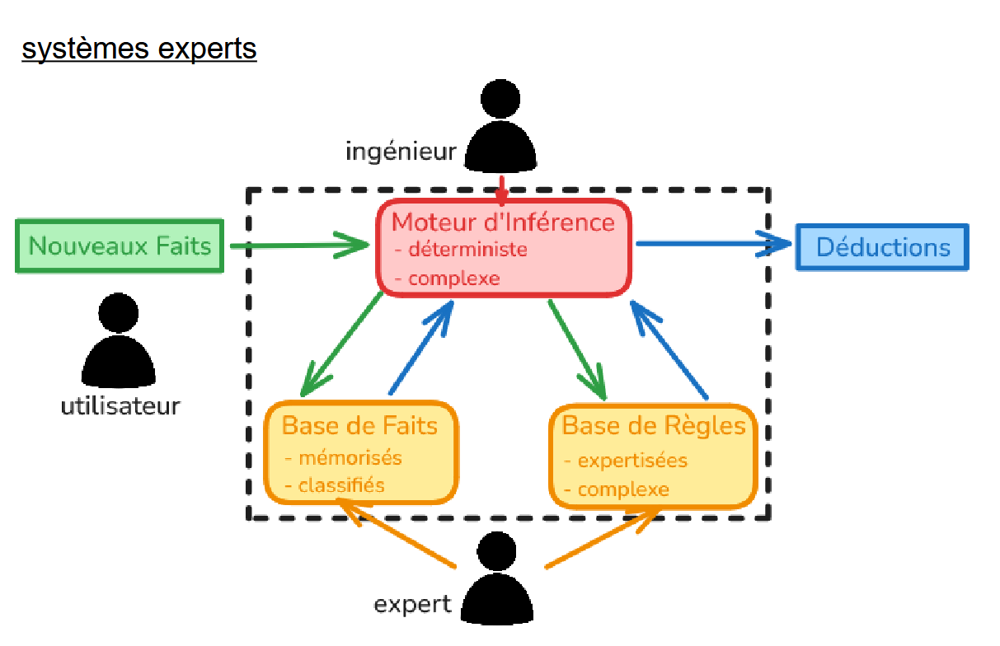
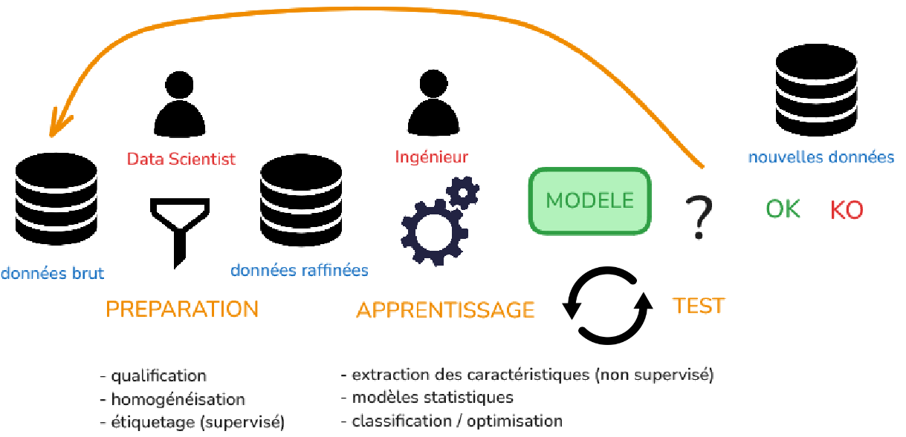
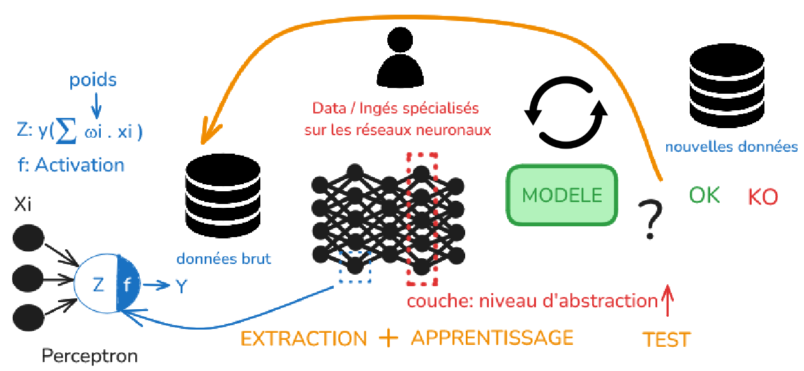

# Lexique IA pour la programmation

### petite introduction aux llms

* **Système Expert**

* **Machine Learning**
  

* **Deep Learning**
  

* **GPT**: Generative Pre-trained **Transformer** 
  + algorithme général de deep learning communément utilisé par les LLMs
+ lié à la notion d'Attention *(cf l'article de 2017 de Vaswani et al. "Attention is all you need")*

* **LLM**: Large Language Model
  + modèle de langage basé sur l'architecture Transformer
  + entraîné sur un grand corpus de texte pour générer du texte cohérent et contextuellement pertinent

* **chatGPT**: client (chat) + **LLM** créé par *OPENAI* (2022)

* **LLama**: LLM créé par *Meta AI*

* **Ollama**: une plateforme pour interagir avec des LLMs locaux et distants.

---

## Table des matières

Section 1 — Le modèle

- [IA](#ai)
- [Modèle](#model)
- [Paramètres](#parameters)
- [Entraînement](#training)
- [Inférence](#inference)
- [Effort](#effort)
- [Jeton](#token)
- [Prédiction du jeton suivant](#next-token-prediction)
- [Non-déterminisme](#non-determinism)
- [Fournisseur de modèles](#model-provider)
- [Harnais](#harness)
- [Requête au fournisseur de modèles](#model-provider-request)
- [Jetons d'entrée](#input-tokens)
- [Jetons de sortie](#output-tokens)
- [Cache de préfixe](#prefix-cache)
- [Jetons en cache](#cache-tokens)

Section 2 — Sessions, fenêtres de contexte et tours

- [Sans état](#stateless)
- [Contexte](#context)
- [Fenêtre de contexte](#context-window)
- [Avec état](#stateful)
- [Agent](#agent)
- [Prompt système](#system-prompt)
- [Session](#session)
- [Tour](#turn)

Section 3 — Outils et environnement

- [Environnement](#environment)
- [Système de fichiers](#filesystem)
- [Outil](#tool)
- [Appel d'outil](#tool-call)
- [Résultat d'outil](#tool-result)
- [MCP](#mcp)
- [Demande d'autorisation](#permission-request)
- [Mode d'autorisation](#permission-mode)
- [Mode agent](#agent-mode)
- [Bac à sable](#sandbox)

Section 4 — Modes de défaillance

- [Sycophantie](#sycophancy)
- [Hallucination](#hallucination)
- [Connaissance paramétrique](#parametric-knowledge)
- [Date limite des connaissances](#knowledge-cutoff)
- [Connaissance contextuelle](#contextual-knowledge)
- [Relation d'attention](#attention-relationship)
- [Budget d'attention](#attention-budget)
- [Dégradation de l'attention](#attention-degradation)
- [Zone intelligente](#smart-zone)

Section 5 — Passages de relais

- [Réinitialisation](#clearing)
- [Passage de relais](#handoff)
- [Source primaire](#primary-source)
- [Source secondaire](#secondary-source)
- [Artefact de transfert](#handoff-artifact)
- [Spécification](#spec)
- [Ticket](#ticket)
- [Compactage](#compaction)
- [Compactage automatique](#autocompact)

Section 6 — Mémoire et pilotage

- [Système de mémoire](#memory-system)
- [AGENTS.md](#agentsmd)
- [Divulgation progressive](#progressive-disclosure)
- [Pointeur de contexte](#context-pointer)
- [Compétence](#skill)
- [Sous-agent](#subagent)

Section 7 — Modes de travail

- [Humain dans la boucle](#human-in-the-loop)
- [AFK](#afk)
- [Vérification automatisée](#automated-check)
- [Revue automatisée](#automated-review)
- [Revue humaine](#human-review)
- [Programmation au feeling](#vibe-coding)
- [Concept de conception](#design-concept)
- [Questionnement approfondi](#grilling)
- [Prototypage](#prototyping)
- [DX](#dx)
- [AX](#ax)

## Section 1 — Le modèle

### IA

Une étiquette mouvante, pas une technologie. « IA » ne désigne pas un objet fixe comme le font un [modèle](#model) ou un [jeton](#token) : elle désigne ce que les ordinateurs parviennent nouvellement à faire de manière impressionnante. Aujourd'hui, elle désigne les grands modèles de langage. Elle a désigné des choses très différentes auparavant :

| Époque    | Ce que signifiait « IA »                                                                                          |
| --------- | ------------------------------------------------------------------------------------------------------------------ |
| Années 1950 | Raisonnement symbolique : démonstrateurs de théorèmes, programmes de dames.                                    |
| Années 1960-70 | Programmes symboliques fondés sur des règles : ELIZA, SHRDLU.                                                |
| Années 1980 | Systèmes experts : des milliers de règles si-alors écrites à la main encodant l'expertise humaine.             |
| Années 1990 | Recherche dans un arbre de jeu : Deep Blue bat Kasparov (1997). Les chercheurs évitent complètement le mot « IA ». |
| Années 2000 | Apprentissage automatique statistique : filtres antispam, systèmes de recommandation. Toujours commercialisé comme « machine learning », pas comme « IA ». |
| Années 2010 | Apprentissage profond : reconnaissance d'images (AlexNet, 2012), AlphaGo (2016).                               |
| Années 2020 | Grands modèles de langage : ChatGPT (2022) fait de « IA » le synonyme de chatbots.                              |

Ce pointeur se déplace selon un mécanisme connu, parfois appelé l'effet IA : dès qu'une technique fonctionne de façon fiable, elle est renommée, ce n'est « que » de la recherche, « que » des statistiques, et « IA » glisse vers le prochain problème non résolu. L'observation est ancienne. Bertram Raphael l'a formulée ainsi en 1971 : « L'IA est un nom collectif pour les problèmes que nous ne savons pas encore résoudre correctement par ordinateur. » La version de Larry Tesler, vers 1979 : « L'intelligence est tout ce que les machines n'ont pas encore fait. »

C'est pourquoi les discussions sur l'IA se croisent si souvent sans se rencontrer. Une affirmation telle que « l'IA ne peut pas raisonner » ou « l'IA est surévaluée » porte un horodatage caché : elle peut concerner les systèmes experts, les classifieurs d'images des années 2010 ou le LLM du mois dernier, et chaque référence conduit à une conclusion différente. Lorsqu'une discussion sur l'IA s'enlise, la solution consiste généralement à remplacer le mot par le terme précis visé : le modèle, le [harnais](#harness), l'[agent](#agent), le [contexte](#context) qui lui a été fourni.

_À éviter :_ « IA » dans toute affirmation technique ; nommez plutôt la partie concernée. « Programmation assistée par IA » convient pour désigner la pratique ; « l'IA hallucine » ne convient pas.

_Utilisation :_

« La CTO veut savoir si l'IA pourrait traiter la file de triage. »

« Traduis cela avant d'en définir le périmètre : elle parle d'un LLM dans un harnais ayant accès au système de tickets. “IA” seule n'est pas une spécification. »

### Modèle

Les [paramètres](#parameters). [Sans état](#stateless), il ne fait que de la [prédiction du jeton suivant](#next-token-prediction). « Claude Opus 4.x » et « GPT-5.x » sont des modèles. À lui seul, un modèle ne peut rien faire d'agentique : il doit être placé dans un [harnais](#harness).

Les modèles ne peuvent ni lire des fichiers, ni exécuter des commandes, ni parcourir le Web, ni se souvenir d'hier : ils reçoivent des [jetons](#token) et en prédisent d'autres, une fois par [requête au fournisseur de modèles](#model-provider-request). Tout ce qui ressemble au travail d'un [agent](#agent), choisir des [outils](#tool), lire des résultats, boucler jusqu'à la fin de la tâche, est le harnais qui orchestre ces nombreuses prédictions successives.

Les [fournisseurs de modèles](#model-provider) proposent des modèles par gammes : un grand modèle, le plus intelligent mais lent et coûteux, et de plus petits, plus rapides et moins chers mais moins capables. Choisir une gamme est une vraie décision : modèle lourd pour la planification et le débogage difficile, modèle léger pour les modifications mécaniques ; les harnais permettent d'en changer au milieu d'une [session](#session).

Employer ce mot avec rigueur affine aussi le diagnostic. « Le modèle est mauvais pour cela » est une affirmation précise : le même modèle, dans un autre harnais ou avec un autre [contexte](#context), se comporte souvent tout autrement. Avant d'accuser le modèle, vérifiez ce qui lui a été fourni : la plupart des sorties décevantes remontent au contexte ou au harnais, pas aux paramètres.

_Utilisation :_

« Devons-nous passer de Sonnet à Opus pour l'étape de planification ? »

« Essaie, mais le harnais fait l'essentiel du travail dans cette tâche. Changer de modèle n'aidera pas si le [prompt système](#system-prompt) et les outils sont mal adaptés. »

### Paramètres

Les nombres qui se trouvent dans un [modèle](#model), souvent par milliards, ajustés pendant l'[entraînement](#training). Tout ce que le modèle « sait » y réside. L'entraînement les définit ; l'[inférence](#inference) les utilise sans les modifier. On les appelle aussi _poids_.

Concrètement, les paramètres transforment l'entrée en sortie. La [prédiction du jeton suivant](#next-token-prediction) est un calcul gigantesque : les [jetons](#token) de la [fenêtre de contexte](#context-window) y entrent, sont multipliés au travers des paramètres, et une prédiction pour le jeton suivant en ressort. Il n'existe ni base de données de faits dans le modèle, ni table de recherche de code : seulement ces nombres, organisés pour que le calcul tende à produire une sortie utile. Les faits que le modèle peut réciter depuis son entraînement, comme une API de bibliothèque standard, sont des [connaissances paramétriques](#parametric-knowledge) : stockés dans les paramètres, sans être récupérés nulle part.

Le détail à retenir est que les paramètres sont figés après l'entraînement. Rien de ce que vous faites dans une [session](#session) ne les modifie : ni une correction, ni un codebase que vous lui montrez, ni une erreur dont il tirerait une leçon. Chaque session repose sur les mêmes nombres. C'est pourquoi le modèle est [sans état](#stateless), pourquoi ses connaissances intégrées s'arrêtent à la [date limite des connaissances](#knowledge-cutoff), et pourquoi tout ce qui est propre au projet doit arriver par le [contexte](#context). La seule façon de modifier les paramètres est de poursuivre l'entraînement, ce qui produit en pratique un modèle différent.

_Utilisation :_

« Peut-on le régler finement sur notre codebase ? »

« Cela modifierait les paramètres, donc le modèle serait différent après. Pour un projet, il est presque toujours moins coûteux de charger le codebase comme contexte que de le réentraîner. »

### Entraînement

Le processus qui règle les [paramètres](#parameters) d'un [modèle](#model), en l'exposant à d'immenses quantités de texte et en ajustant les paramètres pour améliorer la [prédiction du jeton suivant](#next-token-prediction). C'est un processus unique et coûteux réalisé par le [fournisseur de modèles](#model-provider). Il comprend le pré-entraînement, l'exécution principale, et le post-entraînement, des raffinements ultérieurs tels que le suivi d'instructions et la sûreté ; cette distinction n'a pas d'importance au niveau de ce lexique.

Le mécanisme est une répétition à grande échelle : on montre au modèle un passage de texte, on lui fait prédire le [jeton](#token) suivant, on rapproche les paramètres du jeton qui venait réellement ensuite, puis on répète cela sur des milliers de milliards de jetons. Rien n'est enregistré sous forme de faits ou de règles : tout ce que le modèle « sait » est un effet secondaire de l'amélioration de ses prédictions, compressé dans les paramètres sous forme de [connaissance paramétrique](#parametric-knowledge).

Deux conséquences comptent au quotidien. L'entraînement s'arrête à un moment donné ; le modèle a donc une [date limite des connaissances](#knowledge-cutoff) et n'a pas vu la version de bibliothèque que vous avez mise à jour le mois dernier. De plus, vous ne pouvez pas entraîner le modèle : lorsqu'il ne connaît pas votre codebase, vos conventions ou vos API internes, la solution n'est jamais de « l'enseigner au modèle », mais de placer ce matériau dans le [contexte](#context), la seule entrée que vous contrôlez.

_Utilisation :_

« Peut-on lui faire connaître notre API interne ? »

« Pas par l'entraînement : c'est un processus de plusieurs mois pour le fournisseur de modèles. Chargez plutôt la documentation de l'API dans le contexte ; c'est le levier dont vous disposez réellement. »

### Inférence

L'exécution d'un [modèle](#model) entraîné pour générer une sortie : c'est ce qui se produit à chaque [requête au fournisseur de modèles](#model-provider-request). Les [paramètres](#parameters) restent fixes ; le modèle effectue simplement une [prédiction du jeton suivant](#next-token-prediction) sur le [contexte](#context) qui lui est fourni. C'est peu coûteux comparé à l'[entraînement](#training), mais facturé par [jeton](#token) et constitue le coût dominant d'utilisation d'un modèle.

La vie d'un modèle se divise en deux phases :

| Phase | Moment | Ce qu'elle fait | Paramètres |
| ----- | ------ | --------------- | ---------- |
| Entraînement | Une fois, avant la publication | Produit les paramètres à partir d'un corpus d'entraînement | En cours d'écriture |
| Inférence | Chaque fois que quelqu'un utilise le modèle | Exécute les paramètres figés sur votre contexte pour générer des jetons | Lecture seule |

Rien de ce que vous faites lors de l'inférence ne s'écrit dans les paramètres : c'est pourquoi une correction apportée aujourd'hui ne persiste pas demain. Le modèle qui commet la même erreur à la prochaine [session](#session), après que vous avez soigneusement expliqué la solution, ne vous a pas ignoré ; il est incapable d'apprendre de cet échange. Le modèle est [sans état](#stateless) : la continuité doit venir de l'extérieur, de la [fenêtre de contexte](#context-window) ou d'un [système de mémoire](#memory-system).

Ce mécanisme explique aussi votre facturation. Chaque requête exécute le modèle sur le contexte complet ; le coût augmente donc avec les [jetons d'entrée](#input-tokens) et les [jetons de sortie](#output-tokens), et un agent qui effectue des dizaines d'appels d'[outil](#tool) paie l'inférence à chaque aller-retour. C'est pourquoi la taille du contexte est autant une question de coût que de qualité.

_Utilisation :_

« Pourquoi la facture varie-t-elle selon l'utilisation plutôt que d'être une licence forfaitaire ? »

« Vous payez l'inférence : chaque requête au fournisseur de modèles exécute le modèle sur son matériel. L'entraînement a déjà eu lieu, mais les coûts d'inférence s'accumulent par requête, et un seul [tour](#turn) peut se décomposer en de nombreuses requêtes lorsque des outils sont appelés. »

### Effort

L'effort est un réglage de la quantité de raisonnement qu'un [modèle](#model) produit avant de répondre. Défini pour chaque [requête au fournisseur de modèles](#model-provider-request), il contrôle la longueur de la réflexion menée par le modèle avant qu'il commence à écrire la réponse visible. Cette réflexion est générée à l'[inférence](#inference), comme le reste ; le [harnais](#harness) la masque souvent, mais le modèle effectue réellement ce travail.

Un effort plus élevé coûte davantage et s'exécute plus lentement. Le raisonnement est émis sous forme de [jetons](#token), facturés comme des [jetons de sortie](#output-tokens) même lorsque vous ne les voyez jamais, et produits un par un. Augmenter l'effort allonge donc l'attente avant la réponse et la facture. Le compromis oppose une réflexion plus poussée à la vitesse et au coût.

La plupart des harnais présentent l'effort comme une petite échelle :

| Niveau | Utilisation |
| ------ | ----------- |
| Faible | Modifications mécaniques, recherches et changements bien spécifiés ayant une seule voie claire. |
| Moyen | Programmation quotidienne, le réglage habituel. |
| Élevé | Bugs délicats, décisions de conception, plans en plusieurs étapes. |
| Maximum | Les problèmes les plus difficiles, pour lesquels une mauvaise réponse coûte cher à défaire. |

Les conséquences d'un mauvais réglage vont dans les deux sens. Avec un effort trop faible sur un problème difficile, vous obtenez une réponse assurée et superficielle qui a omis le raisonnement nécessaire : elle paraît correcte mais s'avère fausse d'une manière coûteuse plus tard. Réglez-le au maximum pour renommer une ligne et vous attendrez une longue réflexion qui n'apporte rien de plus que le niveau minimal.

Adaptez l'effort à la tâche, pas à la [session](#session). Augmentez-le pour la partie réellement difficile à raisonner, puis réduisez-le pour le travail répétitif autour.

_Utilisation :_

« Il échoue sans cesse sur cette correction de concurrence : je l'ai réexpliquée trois fois. »

« Augmente l'effort. C'est un bug qui demande beaucoup de raisonnement et, avec le réglage par défaut, il ne réfléchit pas assez longtemps avant de s'engager dans une approche. »

### Jeton

L'unité atomique qu'un [modèle](#model) lit et écrit. Sa taille est approximativement celle d'un mot, sans lui être exactement équivalente : les mots courants constituent un jeton, les mots rares ou longs se divisent en plusieurs. La taille de la [fenêtre de contexte](#context-window), le coût et la latence se comptent tous en jetons.

Le texte devient des jetons par un tokenizer : un vocabulaire fixe de dizaines de milliers de fragments, acquis avant l'[entraînement](#training), qui découpe toute entrée en une séquence d'éléments du vocabulaire. Le modèle ne voit jamais les caractères ni les mots : chaque texte est converti en jetons à l'entrée, et la [prédiction du jeton suivant](#next-token-prediction) produit la sortie un jeton à la fois.

En règle générale, un jeton représente environ les trois quarts d'un mot anglais ; mille jetons font donc environ 750 mots. Le code est moins prévisible : les mots-clés et idiomes courants se tokenisent de manière compacte, tandis que les identifiants générés, les hash, les blocs base64 et la sortie minifiée se divisent en beaucoup de jetons par « mot ». Le texte souvent présent dans les données sources du tokenizer reçoit des encodages courts et efficaces ; celui qui n'y figurait pas est découpé en nombreux petits morceaux. Un hash tel que `a3f9c2e1` ne figurait nulle part et se divise donc en plusieurs jetons, tandis que `function` n'en fait qu'un. C'est pourquoi un fichier apparemment petit, rempli de chaînes inhabituelles, peut occuper une part surprenante de la fenêtre de contexte.

Les jetons sont l'unité dans laquelle tout le reste est mesuré. Le coût est calculé par jeton : les fournisseurs facturent séparément les [jetons d'entrée](#input-tokens) et les [jetons de sortie](#output-tokens). La vitesse s'exprime en jetons par seconde puisque la sortie est générée un jeton après l'autre. La fenêtre de contexte contient un nombre fixe de jetons : le nombre de jetons de vos fichiers détermine donc ce qui y tient.

_À éviter :_ « mot » : les frontières des jetons ne correspondent pas à celles des mots, et les unités réellement importantes sont les jetons par seconde et les jetons par dollar.

_Utilisation :_

« Quelle taille aura ce prompt ? »

« Passe-le dans le tokenizer : le schéma est compact, mais les clés JSON sont inhabituelles ; elles se diviseront donc en plus de jetons que tu ne le penses. »

### Prédiction du jeton suivant

Ce que fait réellement le [modèle](#model). À partir d'un [contexte](#context), il échantillonne le [jeton](#token) suivant, l'ajoute, puis recommence. Toute sortie, une phrase, un [appel d'outil](#tool-call) ou un fichier de mille lignes, est construite un jeton à la fois. Le modèle n'a aucun autre mode de fonctionnement.

Chaque étape fonctionne de la même manière : les jetons de la [fenêtre de contexte](#context-window) passent dans les [paramètres](#parameters), qui produisent une probabilité pour chaque jeton du vocabulaire. L'un est très probablement le suivant, l'autre l'est moins. Un jeton est échantillonné parmi ces probabilités, ajouté, puis la boucle recommence avec un contexte légèrement plus long. Cette étape d'échantillonnage explique pourquoi le même prompt produit des sorties différentes à chaque exécution : le [non-déterminisme](#non-determinism) est inhérent au mécanisme, ce n'est pas un défaut ajouté par-dessus.

Garder ce mécanisme à l'esprit explique des comportements qui paraissent autrement étranges. Le modèle ne vérifie jamais qu'un jeton est _vrai_ avant de l'émettre, seulement qu'il est _probable_, ce qui est à l'origine des [hallucinations](#hallucination). Il s'engage sur chaque jeton au fur et à mesure ; une première phrase qui semble assurée peut donc orienter le reste de la réponse dans une mauvaise direction. Et puisque les [jetons de sortie](#output-tokens) sont produits strictement un par un, la vitesse de génération impose une limite à la rapidité de travail d'un [agent](#agent).

_Utilisation :_

« Comment l'agent “décide”-t-il d'appeler un outil ? »

« Il ne décide pas au sens strict : ce n'est que de la prédiction du jeton suivant. L'appel d'outil est simplement une chaîne structurée que le [harnais](#harness) extrait du flux de sortie. »

### Non-déterminisme

La même entrée peut produire des sorties différentes. Exécutez deux fois un [modèle](#model) avec un [contexte](#context) identique et vous pouvez obtenir deux réponses distinctes, parfois un seul mot, parfois une approche complètement différente. Aucun changement de votre code n'est nécessaire pour que cela arrive.

C'est une propriété de la façon dont les modèles génèrent du texte et dont les [fournisseurs de modèles](#model-provider) servent les [requêtes](#model-provider-request). Lors de l'[inférence](#inference), le modèle produit une distribution de probabilités sur les [jetons](#token) suivants possibles, puis l'un d'eux est échantillonné, généralement avec une part de hasard volontaire : toujours choisir le jeton le plus probable produit un texte répétitif et de moins bonne qualité. Un jeton échantillonné différemment au début d'une réponse modifie tous les suivants ; c'est ainsi qu'un mot différent devient une approche complètement différente. L'infrastructure du fournisseur ajoute encore de la variation : les requêtes sont regroupées sur du matériel partagé et d'infimes différences de calcul en virgule flottante entre lots peuvent faire basculer un choix serré entre deux jetons. Aucun réglage ne permet de supprimer entièrement ce phénomène.

Attendez-vous à une dispersion des résultats d'un [agent](#agent) sur une même tâche. La plupart des réponses se situent dans une courbe de qualité raisonnable, ce qui rend le non-déterminisme tolérable, mais les extrêmes sont réels : certains jours le modèle paraît vif, d'autres il semble avoir perdu le fil. Même tâche, tirages différents. Cela a deux conséquences pratiques. Réessayer est une stratégie légitime : un échec est un tirage dans la distribution et une nouvelle tentative peut simplement mieux tomber. La vérification compte aussi davantage qu'avec des outils déterministes : on ne peut pas tester une fois le comportement d'un agent et compter sur sa répétition ; les [vérifications automatisées](#automated-check) doivent intercepter les mauvais tirages.

Évitez toutefois d'en tirer un récit excessif. Les humains repèrent des motifs, et une série de mauvaises exécutions peut sembler prouver que « le modèle s'est dégradé cette semaine ». En général, ce n'est que la distribution.

_Utilisation :_

« Claude a été médiocre aujourd'hui. Ont-ils publié une version moins bonne ? »

« Probablement pas. La sortie du modèle est non déterministe : vous aurez de bons et de mauvais résultats sur une même tâche. Réessayez demain avant de chercher une cause. »

### Fournisseur de modèles

Tout service qui exécute un [modèle](#model) pour l'[inférence](#inference). Il s'agit généralement d'un service distant (Anthropic, OpenAI, Google), mais il peut aussi être local : Ollama, LM Studio ou llama.cpp exécuté sur votre propre machine. Le [harnais](#harness) n'exécute pas lui-même le modèle ; il le demande à un fournisseur.

Le fournisseur possède l'infrastructure : les [paramètres](#parameters) résident sur son matériel et chaque [requête au fournisseur de modèles](#model-provider-request) consiste pour le harnais à envoyer des [jetons](#token) sur le réseau et à recevoir des prédictions. Il est donc à l'origine de toute une catégorie de problèmes souvent attribués à tort au modèle ou au harnais : limites de débit, capacité dégradée et pannes relèvent tous de lui. Lorsqu'un [agent](#agent) se bloque au milieu d'une [session](#session) ou échoue à chaque [tour](#turn), consultez d'abord la page d'état du fournisseur.

Le fournisseur définit aussi les conditions commerciales : tarification par jeton pour les [entrées](#input-tokens) et les [jetons de sortie](#output-tokens), remises liées au [cache de préfixe](#prefix-cache) et modèles disponibles. Le fournisseur et le créateur du modèle peuvent être des entreprises différentes : Bedrock, Vertex et OpenRouter proposent les modèles d'autres entreprises.

Les fournisseurs locaux échangent de la capacité contre du contrôle : les modèles qui tiennent sur votre matériel sont bien plus petits que les modèles de pointe, mais aucune donnée ne quitte la machine et il n'y a pas de facturation par jeton.

_Utilisation :_

« Peut-on faire fonctionner cela hors ligne pour le client isolé du réseau ? »

« Remplacez le fournisseur de modèles par un fournisseur local, Ollama ou llama.cpp sur sa machine. Le harnais s'en moque : il appelle simplement un autre point de terminaison. »

### Harnais

Tout ce qui entoure le [modèle](#model) pour le transformer en [agent](#agent) : [outils](#tool), [prompt système](#system-prompt), gestion de la [fenêtre de contexte](#context-window), autorisations et hooks. **Claude.ai** et **Claude Code** s'appuient sur le même modèle, mais se comportent différemment parce que leurs harnais diffèrent.

Le modèle ne fait lui-même qu'une chose : recevoir du texte et produire du texte. Il ne peut ni lire un fichier, ni exécuter une commande, ni se souvenir du dernier [tour](#turn). Le harnais fournit tout cela. Il assemble le [contexte](#context) de chaque [requête au fournisseur de modèles](#model-provider-request), exécute les [appels d'outil](#tool-call) demandés par le modèle, y réinjecte les [résultats d'outil](#tool-result), conserve l'historique de la [session](#session), vous demande une autorisation avant les actions risquées et décide quand [compacter](#compaction). La boucle de l'agent, le modèle propose, le harnais exécute, puis on recommence, est exécutée par le harnais.

Cela compte pour le diagnostic. Quand le comportement diffère entre deux produits, ou entre hier et aujourd'hui, le modèle n'est souvent pas la variable : c'est le harnais. Un prompt système différent, un autre ensemble d'outils, une autorisation par défaut modifiée ou une nouvelle stratégie de gestion du contexte changent tous le comportement sans modifier le modèle. C'est aussi dans le harnais que réside l'essentiel de votre configuration : les fichiers [AGENTS.md](#agentsmd), les réglages d'autorisation et les hooks sont tous des instructions destinées au harnais, pas au modèle.

Exemples : Claude Code, Cursor, Codex CLI, ainsi que Claude.ai, qui est un harnais de conversation plutôt que de programmation.

_Utilisation :_

« Même modèle : pourquoi Claude Code modifie-t-il les fichiers alors que Claude.ai répond seulement aux questions ? »

« Les harnais sont différents : Claude Code dispose d'outils de [système de fichiers](#filesystem), d'un autre prompt système et d'une couche d'autorisations. Le modèle n'est pas la variable ici. »

### Requête au fournisseur de modèles

Un aller-retour entre le [harnais](#harness) et le [fournisseur de modèles](#model-provider). Le harnais envoie le [contexte](#context) courant ; le fournisseur renvoie une réponse, un [appel d'outil](#tool-call) ou une réponse finale. Un seul message utilisateur peut engendrer de nombreuses requêtes au fournisseur de modèles si l'[agent](#agent) appelle des [outils](#tool) : chaque [résultat d'outil](#tool-result) déclenche une nouvelle requête.

Chaque requête transporte tout : le [prompt système](#system-prompt), la conversation complète jusqu'alors, chaque résultat d'outil. Le [modèle](#model) est [sans état](#stateless), le fournisseur ne conserve donc rien entre les requêtes : la requête quarante renvoie ce qu'avait envoyé la requête trente-neuf, avec un résultat d'outil supplémentaire. Le [cache de préfixe](#prefix-cache) rend cette répétition abordable.

La requête est également l'unité de facturation. Les [jetons d'entrée](#input-tokens), les [jetons de sortie](#output-tokens) et les remises liées au cache sont tous comptés par requête. C'est pourquoi une question apparemment anodine peut coûter étonnamment cher : le coût n'est pas proportionnel à votre message, mais au nombre de requêtes multiplié par la taille du contexte transporté par chacune.

Il est utile de distinguer la requête du [tour](#turn). Un tour est un échange avec vous, et un seul tour, « corrige le test en échec », se déroule sous la forme d'une chaîne de requêtes :

| Requête | Le modèle renvoie                        | Le harnais fait ensuite                         |
| -------- | ---------------------------------------- | ----------------------------------------------- |
| 1        | Appel d'outil : exécuter les tests       | Les exécute et ajoute la sortie de l'échec      |
| 2        | Appel d'outil : lire le fichier de test  | Ajoute le contenu du fichier                    |
| 3        | Appel d'outil : lire le fichier source   | Ajoute le contenu du fichier                    |
| 4        | Appel d'outil : modifier le fichier source | Applique la modification et ajoute le résultat |
| 5        | Appel d'outil : exécuter à nouveau les tests | Les exécute et ajoute la sortie de réussite  |
| 6        | Réponse finale : « corrigé, les tests passent » | Vous l'affiche                            |

Six requêtes pour un seul tour : chacune renvoie le contexte complet. Lorsque vous vous demandez où sont passés les [jetons](#token), comptez les requêtes, pas les tours.

_Utilisation :_

« Une seule question a consommé quarante mille jetons ? »

« Regardez les appels d'outil : douze recherches `grep`, huit lectures, quatre modifications. Chaque résultat d'outil engendre une nouvelle requête au fournisseur de modèles, et le préfixe de la [session](#session) est renvoyé à chaque fois. »

### Jetons d'entrée

Les [jetons](#token) que le [harnais](#harness) envoie lors de chaque [requête au fournisseur de modèles](#model-provider-request) : le [prompt système](#system-prompt), l'historique de conversation, les [résultats d'outil](#tool-result), tout ce que le [modèle](#model) lit avant d'écrire. Ils sont facturés à un tarif inférieur à celui des [jetons de sortie](#output-tokens), car ils sont moins coûteux à traiter.

En programmation [IA](#ai), les jetons d'entrée constituent l'essentiel de votre facture. Le modèle est [sans état](#stateless), chaque [tour](#turn) renvoie donc la [session](#session) complète en entrée : votre premier message, chaque réponse et chaque résultat d'outil depuis lors. L'entrée du cinquantième tour contient les quarante-neuf tours précédents. Une seule requête au fournisseur de modèles peut produire quelques centaines de jetons de sortie tout en renvoyant cent mille jetons d'entrée d'historique accumulé.

Le [cache de préfixe](#prefix-cache) réduit ce coût : l'historique qui correspond exactement à une requête précédente est facturé sous forme de [jetons en cache](#cache-tokens), moins onéreux, plutôt qu'au tarif d'entrée complet. Lorsque les coûts d'entrée restent élevés, la solution consiste à réduire ce qui est renvoyé : [réinitialiser](#clearing) ou [compacter](#compaction) entre les tâches.

_Utilisation :_

« La facture est élevée, mais l'[agent](#agent) écrit à peine. »

« Ce sont les jetons d'entrée : chaque tour renvoie la session entière. Sans le cache de préfixe, vous repayez l'historique à chaque requête. »

### Jetons de sortie

Les [jetons](#token) générés en retour par le [modèle](#model). Ils sont facturés à un tarif supérieur à celui des [jetons d'entrée](#input-tokens), souvent environ cinq fois plus élevé, car leur production demande davantage de calcul.

Tout ce que le modèle écrit compte : le texte que vous lisez, le code qu'il émet, les [appels d'outil](#tool-call) et toute réflexion approfondie qu'il mène avant de répondre. Ce dernier point surprend souvent : les jetons de raisonnement sont facturés comme de la sortie même lorsque le [harnais](#harness) ne vous les montre pas, et augmenter l'[effort](#effort) en consomme davantage.

Les jetons de sortie déterminent aussi le rythme d'une [session](#session). Le modèle lit les entrées rapidement, mais génère la sortie un jeton à la fois. Lorsqu'un [tour](#turn) paraît lent, c'est donc presque toujours la sortie en cours d'écriture, et non l'entrée en cours de lecture. Une longue attente annonce généralement une longue réponse.

_Utilisation :_

« La session de refactorisation consume du crédit alors que les entrées sont petites. »

« L'agent réécrit des fichiers entiers au lieu d'appliquer des correctifs. Les jetons de sortie coûtent environ cinq fois le tarif des entrées : faites-lui émettre des modifications, et la facture baissera. »

### Cache de préfixe

Le stockage côté [fournisseur](#model-provider) qui permet à des [requêtes au fournisseur de modèles](#model-provider-request) consécutives d'éviter de retraiter un préfixe commun. Lorsque le début d'une requête correspond au début d'une requête récente, même [prompt système](#system-prompt), même historique jusqu'à un certain point, le fournisseur réutilise son travail précédent et facture ces [jetons](#token) comme des [jetons en cache](#cache-tokens), à un tarif bien inférieur.

Le cache est rentable parce que les sessions grandissent par ajouts successifs. Chaque requête renvoie tout l'historique sous forme de [jetons d'entrée](#input-tokens), et dans une [session](#session) normale, l'historique ne change qu'à la fin : chaque requête reprend la précédente en y ajoutant quelques nouveaux messages. Le fournisseur traite une fois le long début commun, stocke le résultat, puis reprend là où le préfixe s'arrête. Sans le cache, une session de cinquante [tours](#turn) paierait cinquante fois le retraitement du premier tour.

Les caches expirent également. La durée pendant laquelle une entrée reste active varie selon le fournisseur de modèles, généralement quelques minutes, pas quelques heures. Si une session reste inactive au-delà de cette durée, la requête suivante reconstruit une fois le préfixe au tarif complet avant que la mise en cache reprenne. Cela concerne surtout les créateurs de [harnais](#harness) ; pour l'utilisateur, l'effet visible est que les requêtes après une longue pause coûtent plus cher que celles qui la précèdent.

_Utilisation :_

« Pourquoi la facture a-t-elle augmenté brusquement au milieu de la session ? »

« Le harnais a commencé à injecter l'heure courante dans le prompt système à chaque tour. Le cache de préfixe se brise au premier jeton modifié, donc chaque requête suivante est facturée au tarif complet. »

### Jetons en cache

Des [jetons d'entrée](#input-tokens) que le [fournisseur](#model-provider) a mis en cache à partir d'une précédente [requête au fournisseur de modèles](#model-provider-request), afin de ne pas avoir à les retraiter. Lorsque des requêtes consécutives partagent un préfixe, le fournisseur réutilise le travail grâce à son [cache de préfixe](#prefix-cache) et facture la partie mise en cache à un tarif bien inférieur. C'est ce qui rend les longues [sessions](#session) abordables : sans cela, chaque [tour](#turn) repaierait tout l'historique.

L'importance de ce mécanisme vient du mode de facturation des sessions. Le [modèle](#model) est [sans état](#stateless), chaque requête renvoie donc toute la conversation, le [prompt système](#system-prompt), chaque message et chaque [résultat d'outil](#tool-result), sous forme de jetons d'entrée. Au cinquantième tour, chaque requête transporte cinquante tours d'historique, qui seraient tous facturés au tarif complet à chaque fois. Le cache change le calcul : les jetons que le fournisseur a déjà traités dans un préfixe identique sont facturés comme jetons en cache, souvent à un dixième du tarif d'entrée, voire moins. Au cours d'une longue session, la plupart des jetons envoyés sont ainsi en cache, et la facture reste raisonnable.

Cet exemple montre quand les jetons sont mis en cache et quand ils ne le sont pas. Chaque lettre représente un bloc de contenu de la conversation ; chaque requête envoie la conversation accumulée :

| La requête envoie | En cache | Facturé au tarif complet | Pourquoi                                             |
| ----------------- | -------- | ------------------------ | ---------------------------------------------------- |
| `AB`              | rien     | `AB`                     | Première requête : aucun élément auquel correspondre |
| `ABC`             | `AB`     | `C`                      | `AB` est un préfixe exact de la requête précédente   |
| `ABCD`            | `ABC`    | `D`                      | Le préfixe est toujours intact                       |
| `AXCD`            | `A`      | `XCD`                    | Une modification a remplacé `B` par `X` ; la correspondance échoue ici |

Le cache est fragile d'une manière précise : il compare des préfixes exacts. Si un élément plus tôt dans la conversation change, si le [harnais](#harness) réorganise le contenu, qu'un horodatage est mis à jour ou que la représentation d'un fichier varie, le cache échoue à partir de ce point et tout ce qui suit est facturé au tarif d'entrée complet. Les caches expirent aussi après quelques minutes d'inactivité : une session reprise après une longue pause repaie une fois son historique. Lorsqu'une session devient coûteuse sans raison apparente, comparez les jetons en cache et les jetons d'entrée dans le rapport d'utilisation : c'est là qu'un cache défaillant apparaît d'abord.

_Utilisation :_

« Le coût des longues sessions est brutal : huit dollars pour une refactorisation. »

« Vérifiez les jetons en cache. Si le harnais réorganise le prompt système ou les fichiers entre les tours, le préfixe est rompu et chaque requête repaie le tarif d'entrée complet. »

## Section 2 — Sessions, fenêtres de contexte et tours

### Sans état

Ne conserve aucune information d'une interaction à l'autre. Le [modèle](#model) est sans état entre les [requêtes au fournisseur de modèles](#model-provider-request) : chaque requête renvoie la [fenêtre de contexte](#context-window) complète, car le modèle ne peut rien voir d'autre. Par défaut, un [agent](#agent) est sans état entre les [sessions](#session) : une nouvelle session commence vide, sans trace des précédentes. Contraire d'[avec état](#stateful).

Le modèle lui-même est en permanence sans état : ses [paramètres](#parameters) sont figés après l'[entraînement](#training), et rien de ce que vous faites à l'[inférence](#inference) ne les modifie. Le modèle n'apprend pas de vos corrections, ne se souvient pas qu'on lui a dit la même chose hier et n'apprend pas à vous connaître, aussi continue que puisse sembler la conversation. La continuité ressentie au sein d'une session est fabriquée par le [harnais](#harness), qui conserve la transcription et la renvoie à chaque requête. Le modèle ne se souvient pas de la conversation, il la relit.

La conséquence pratique est la suivante : si vous souhaitez qu'une information soit mémorisée entre les sessions, vous devez l'écrire quelque part où l'agent la relira. C'est le rôle des fichiers [AGENTS.md](#agentsmd), des [systèmes de mémoire](#memory-system) et des [artefacts de passage de relais](#handoff-artifact) : ils sont chargés dans le [contexte](#context) des sessions futures et remplacent la mémoire dont le modèle est dépourvu. Lorsque l'agent répète une erreur que vous avez déjà corrigée, la question n'est pas pourquoi il n'a pas appris, il ne le peut pas, mais où écrire cette correction pour que toutes les sessions futures la lisent.

_Utilisation :_

« Pourquoi oublie-t-il la convention à chaque [réinitialisation](#clearing) ? »

« Le modèle est sans état : la nouvelle session commence vide. Si vous voulez conserver l'information, écrivez-la dans AGENTS.md ou dans un fichier de mémoire que le harnais charge au début de la session. »

### Contexte

Les informations pertinentes auxquelles l'[agent](#agent) a accès à un instant donné. C'est un nom abstrait : ni l'entrée brute vue par le modèle, qui est la [fenêtre de contexte](#context-window), ni l'historique en cours, qui est la [session](#session), mais ce que l'agent sait qui est pertinent pour la tâche. « Charger quelque chose dans le contexte » signifie l'ajouter à cet ensemble ; l'« ingénierie de contexte » est la discipline qui consiste à le sélectionner.

Les trois termes se distinguent clairement :

| Terme | Ce qu'il désigne |
| ----- | ---------------- |
| Contexte | Les informations pertinentes pour la tâche dont l'agent dispose actuellement |
| Fenêtre de contexte | La séquence littérale de [jetons](#token) que le modèle voit à chaque requête |
| Session | La conversation en cours que le [harnais](#harness) conserve |

Cette distinction importe parce que le contexte est une mesure de qualité, pas de quantité. Une fenêtre de contexte peut être presque pleine tout en contenant un mauvais contexte, avec des milliers de jetons de résultats d'outil périmés, sans rapport avec la tâche en cours. Elle peut également être presque vide et contenir un excellent contexte : l'unique définition de type dont dépend la tâche.

La plupart des échecs courants remontent au contexte. Lorsque l'agent invente une API, contredit une décision ou devine un schéma, la première question est de savoir ce qui était dans le contexte à ce moment-là. En général, le fait pertinent n'a jamais été chargé ou se trouvait enfoui sous la [dégradation de l'attention](#attention-degradation). La solution consiste à sélectionner : charger ce dont la tâche a besoin et écarter le reste.

_Utilisation :_

« Il continue d'inventer des champs qui n'existent pas dans le type. »

« Le fichier de types n'est pas dans le contexte : il lit les sites d'appel et devine. Commencez par lire la définition. »

### Fenêtre de contexte

Tout ce que le [modèle](#model) voit lors de chaque [requête au fournisseur de modèles](#model-provider-request). Elle est finie, propre à chaque modèle, et constitue la seule surface par laquelle le modèle perçoit quoi que ce soit.

C'est une séquence unique de [jetons](#token) : le [prompt système](#system-prompt), la conversation jusqu'alors et chaque [résultat d'outil](#tool-result) que le [harnais](#harness) a réinjecté. Si un élément se trouve dans cette séquence, le modèle peut l'utiliser ; sinon, il ignore son existence, qu'il s'agisse de votre base de code, du fichier modifié hier ou d'une instruction donnée trois sessions auparavant. Tout ce qui est hors de la fenêtre doit y être introduit, généralement par un [appel d'outil](#tool-call), avant de pouvoir influer sur quoi que ce soit.

Le caractère fini implique qu'elle se remplit. Chaque tour ajoute du contenu, vos messages, les réponses du modèle et les résultats d'outil, et une longue [session](#session) finit par atteindre la limite, imposant une [compaction](#compaction) ou une [réinitialisation](#clearing). Cela signifie aussi que tous les éléments de la fenêtre sont en concurrence : chaque jeton chargé laisse une place de moins au reste, et le contenu inutile occupe malgré tout le [budget d'attention](#attention-budget) du modèle. Considérez donc la fenêtre comme un budget : chargez ce dont la tâche a besoin et laissez le reste de côté.

_À éviter :_ « mémoire » : la fenêtre de contexte est un état de travail et ne persiste pas entre les sessions. La [mémoire](#memory-system) est un concept distinct, ajouté par-dessus.

_Utilisation :_

« Puis-je simplement coller tout le monorepo dans le prompt ? »

« La fenêtre de contexte contient 200 000 jetons, soit peut-être un cinquième du dépôt. Choisissez les fichiers concernés par la tâche et laissez les autres derrière un appel d'outil. »

### Avec état

Conserve des informations d'une interaction à l'autre. Une [session](#session) est avec état entre les [tours](#turn) : le [contexte](#context) s'accumule au fil de son déroulement, ce qui explique que les longues sessions dérivent vers la [zone stupide](#smart-zone). Un [agent](#agent) peut être rendu avec état entre les **sessions** en ajoutant un [système de mémoire](#memory-system) qui inscrit les informations dans l'[environnement](#environment) et les recharge au début des sessions futures. Le [modèle](#model) n'est jamais avec état ; toute continuité apparente provient du [harnais](#harness) qui lui fournit à nouveau le contexte. Contraire de [sans état](#stateless).

Voici où réside l'état à chaque couche :

| Couche | Avec état ? | Comment |
| ------ | ----------- | ------- |
| Modèle | Jamais | Les [paramètres](#parameters) sont figés ; il ne voit que ce qui figure dans chaque requête |
| Session | Entre les tours | Le harnais ajoute chaque message et chaque [résultat d'outil](#tool-result) au contexte |
| Harnais | Entre les sessions | Fichiers de mémoire, [AGENTS.md](#agentsmd), [artefacts de passage de relais](#handoff-artifact), écrits puis rechargés ultérieurement |
| Environnement | Toujours | Les fichiers persistent, qu'une session soit en cours ou non |

L'état de chaque couche est construit en relisant un élément stocké dans la couche inférieure : la session semble continue parce que le harnais renvoie l'historique des messages au modèle sans état, et l'agent se souvient d'une session à l'autre parce que le harnais recharge des fichiers depuis l'environnement. Aucun état n'est jamais stocké dans le modèle lui-même.

L'état n'est pas toujours souhaitable. Tout ce qui est transmis influence la suite ; une hypothèse erronée formulée tôt dans une session est donc elle aussi transmise. La [réinitialisation](#clearing) consiste délibérément à abandonner l'état de la session pour repartir de ce qui a été écrit.

_Utilisation :_

« Il s'est souvenu de mes préférences d'hier : cela signifie-t-il que le modèle les a apprises ? »

« Non, l'agent est avec état parce que le harnais les a écrites dans un fichier de mémoire et l'a rechargé au début de la session. Le modèle lui-même n'a rien vu d'hier. »

### Agent

Un [modèle](#model) entouré par un [harnais](#harness), avec des [outils](#tool), un [prompt système](#system-prompt) et une [fenêtre de contexte](#context-window), qui échange des [tours](#turn) avec un utilisateur. _Claude Code est un agent. Cursor est un agent. Claude.ai est un agent._ L'agent est ce à quoi vous parlez réellement : le modèle en action, configuré dans un but précis.

Contrairement à la plupart des termes de ce lexique, « agent » ne désigne pas une pièce mécanique. Le modèle est un fichier de [paramètres](#parameters) ; le harnais est un logiciel que l'on peut configurer. L'agent n'est ni l'un ni l'autre : c'est l'entité à laquelle vous vous adressez. Les humains anthropomorphisent constamment l'[IA](#ai), et l'agent est cette entité anthropomorphisée : ce à quoi vous déléguez une tâche, ce qui lit votre message et répond, le « il » dans « il a encore cassé la compilation ». Dire qu'un agent a fait quelque chose revient à dire que le modèle et le harnais l'ont fait, mais en considérant l'ensemble comme un seul acteur.

L'idée précède la vague actuelle de l'IA. Les agents logiciels, des programmes auxquels vous déléguez un objectif et qui agissent en votre nom, sont un concept aussi ancien que l'IA.

_À éviter :_ « l'IA », « le bot » : ces termes sont trop vagues et ne précisent pas si vous parlez des paramètres ou de l'ensemble formé avec le harnais.

_Utilisation :_

« Quel agent utilises-tu pour la migration ? »

« Claude Code en local, Cursor pour l'interface : même modèle sous-jacent, harnais différents. »

### Prompt système

Les instructions que le [harnais](#harness) ajoute au début de chaque [requête au fournisseur de modèles](#model-provider-request) : la feuille de route permanente de l'[agent](#agent), qui précise son identité, son comportement, les [outils](#tool) qu'il peut appeler et les conventions à suivre. Il reste généralement stable pendant une [session](#session).

Le prompt système est écrit par le fournisseur du harnais, non par vous. Dans les harnais de programmation, il est volumineux : souvent des dizaines de milliers de [jetons](#token) de règles de comportement, de descriptions d'outils et de traitement des cas limites, tous facturés comme [jetons d'entrée](#input-tokens) à chaque [tour](#turn). Vos propres instructions permanentes l'accompagnent : des fichiers comme [AGENTS.md](#agentsmd) sont chargés à côté du prompt système au début de la session, de sorte que le [modèle](#model) lit simultanément les consignes du fournisseur et les vôtres avant même de voir votre message.

Comme il est identique dans chaque requête, il constitue le début du [cache de préfixe](#prefix-cache). C'est notamment pour cela que les harnais le maintiennent fixe pendant toute une session plutôt que de le modifier progressivement.

Les modèles sont entraînés à donner priorité au prompt système plutôt qu'aux messages utilisateur. Lorsqu'un agent insiste sur une convention que vous n'avez jamais demandée ou met en forme sa réponse d'une manière impossible à changer, il obéit généralement à son prompt système, et votre message perd la discussion. Certains harnais sont personnalisables : ils donnent accès au prompt système complet, ce qui permet de lire les consignes réellement données à l'agent et de les modifier.

_Utilisation :_

« Deux harnais, le même modèle, un comportement totalement différent avec le même prompt. »

« Leurs prompts système diffèrent. L'un est réglé pour des modifications de code concises, l'autre pour l'explication : la divergence se produit là, avant même l'arrivée de votre message. »

### Session

Une séquence limitée d'interactions avec un [agent](#agent). Elle commence vide, accumule les messages, les [résultats d'outil](#tool-result) et les fichiers lus, puis s'achève lorsqu'elle est [réinitialisée](#clearing), fermée ou [compactée](#compaction) en une nouvelle session. La session est ce qui remplit la [fenêtre de contexte](#context-window) : si la fenêtre est la boîte, la session est le contenu qui s'y accumule peu à peu. Un travail trop grand pour une seule fenêtre de contexte doit être réparti entre plusieurs sessions.

L'historique des messages d'une session constitue la mémoire de travail de l'agent. Le [modèle](#model) est [sans état](#stateless), donc tout ce dont il semble se souvenir, ce que vous avez demandé, les résultats des tests ou une décision prise trois tours plus tôt, se trouve dans cet historique, renvoyé à chaque [requête au fournisseur de modèles](#model-provider-request). Ce qui n'est pas dans la session n'existe pas pour l'agent.

Cette mémoire s'arrête avec la session. Une nouvelle session recommence sans rien : l'agent qui connaissait très bien votre base de code à la fin de la session d'hier n'en sait plus rien ce matin. Ce qui perdure est le [système de fichiers](#filesystem) : les fichiers écrits durant une session peuvent être lus par la suivante, sur quoi reposent les [passages de relais](#handoff), les [systèmes de mémoire](#memory-system) et [AGENTS.md](#agentsmd).

Vous choisissez où une session s'arrête. Tout ce qu'elle contient influence les [tours](#turn) ultérieurs ; des tâches sans rapport, réalisées dans une même session, laissent donc des résidus qui colorent la réponse suivante. Une tâche par session maintient le contexte pertinent ; terminer une tâche est un moment naturel pour réinitialiser.

_Utilisation :_

« Combien de temps une session peut-elle durer avant de se dégrader ? »

« Cela dépend du travail : une refactorisation ciblée reste nette plus longtemps qu'une recherche ouverte. Quand la session devient trop volumineuse, faites un passage de relais ou compactez-la, n'insistez pas. »

### Tour

Un message utilisateur et tout ce que l'[agent](#agent) fait en réponse, jusqu'à ce qu'il vous rende la main. Il contient une ou plusieurs [requêtes au fournisseur de modèles](#model-provider-request), et souvent beaucoup si l'agent appelle des [outils](#tool). Une question de clarification clôt le tour ; votre réponse ouvre le suivant. La hiérarchie est [session](#session) **> Tour > Requête au fournisseur de modèles**.

Ce qui rend utile de nommer le tour est que sa durée dépend de l'agent, non de vous. Vous lui transmettez un message ; il décide combien d'appels d'outil enchaîner avant de rendre la main. Un tour peut être une réponse d'une phrase ou vingt minutes de lecture, de modifications et d'exécution de tests. Cette propriété a deux faces : les longs tours rendent possible le travail [AFK](#afk), mais c'est aussi durant eux que les choses se dégradent sans supervision. Au moment où l'agent vous rend la main, il peut avoir largement dérivé de votre intention.

Le tour est aussi l'unité naturelle de pilotage. Tout ce qui s'y déroule se produit sans vous ; les intervalles entre les tours sont les moments où vous réorientez l'agent. La plupart des [harnais](#harness) atténuent cette séparation : vous pouvez interrompre l'agent en plein tour pour le rediriger, ou écrire un message pendant qu'il travaille, qui sera lu à la fin du tour. Si le résultat des tours vous déplaît régulièrement, la solution consiste généralement à demander des tours plus courts, avec un plan d'abord et une étape à la fois, en échangeant une part d'autonomie contre davantage d'occasions de réorienter.

_Utilisation :_

« Un tour a pris deux minutes ? »

« L'agent a effectué quatorze [appels d'outil](#tool-call) durant ce tour : chacun est une requête distincte au fournisseur de modèles. La latence s'accumule avant qu'il vous rende enfin la main. »

## Section 3 — Outils et environnement

### Environnement

Le monde sur lequel agit l'[agent](#agent) : tout ce qui est hors du [harnais](#harness), que l'agent perçoit au moyen des [résultats d'outil](#tool-result) et modifie par des [appels d'outil](#tool-call). Le harnais _exécute_ l'agent ; l'environnement est ce dans quoi l'agent _travaille_. Un fichier comme [AGENTS.md](#agentsmd) vit dans l'environnement ; le harnais le charge dans la [fenêtre de contexte](#context-window). Un [système de fichiers](#filesystem) est la forme d'environnement la plus courante, mais pas la seule : une base de données, une API distante ou une session de navigateur peuvent aussi être des environnements.

L'agent ne voit l'environnement que lorsqu'il l'examine. Tout ce qu'il en sait lui est arrivé par un résultat d'outil ; son image est donc une collection d'instantanés, exacts au moment où ils ont été capturés. Si un fichier change après avoir été lu par l'agent, parce que vous le modifiez à la main ou qu'une étape de compilation le régénère, l'agent continue de raisonner à partir de sa copie périmée jusqu'à ce qu'il le relise. Lorsqu'un agent décrit avec assurance un fichier qui ne ressemble plus à cela, c'est généralement ce qui s'est passé : l'environnement a changé, pas l'instantané.

L'environnement est aussi la couche qui persiste, la seule qui soit toujours [avec état](#stateful). Le contexte d'une [session](#session) disparaît à sa fin, mais les fichiers écrits dans l'environnement restent disponibles pour la session suivante. C'est sur cela que reposent les [systèmes de mémoire](#memory-system), les [artefacts de passage de relais](#handoff-artifact) et `AGENTS.md`. Tout ce qu'un agent devra encore savoir demain doit aboutir dans l'environnement.

Vous décidez de la taille de l'environnement. Un [bac à sable](#sandbox) le réduit en limitant ce que l'agent peut atteindre ; ajouter un [outil](#tool) l'étend en mettant une base de données ou une API à sa portée. Ce qui est à l'intérieur de la frontière est ce que l'agent peut percevoir et modifier ; tout ce qui est à l'extérieur n'existe pas pour lui. La qualité de la préparation de l'environnement pour soutenir le travail de l'agent correspond à l'[AX](#ax) de la base de code.

_À éviter :_ employer « environnement » pour désigner le runtime ou le harnais lui-même : le harnais est l'enveloppe, l'environnement est l'espace de travail.

_Utilisation :_

« L'agent ne voit pas le schéma de la base de données de préproduction. »

« Intégrez-le à l'environnement : donnez-lui un outil `psql` limité à la lecture seule en préproduction. Le harnais est correct ; il n'a simplement rien sur quoi agir. »

### Système de fichiers

Une arborescence de fichiers et de répertoires que l'[agent](#agent) lit, modifie et dans laquelle il exécute des commandes : la forme d'[environnement](#environment) par défaut d'un agent de programmation. [AGENTS.md](#agentsmd), les [compétences](#skill), le code source, les scripts de compilation et les configurations d'[outils](#tool) résident tous dans un système de fichiers. Lorsqu'un [harnais](#harness) « démarre dans votre projet », il oriente l'agent vers un système de fichiers.

L'agent n'y accède qu'au moyen d'[appels d'outil](#tool-call) : lire ou écrire un fichier, exécuter une commande shell. Rien de ce qui est sur le disque n'entre dans la [fenêtre de contexte](#context-window) avant qu'un appel d'outil ne le charge. C'est ce qui permet à l'agent de travailler dans un dépôt bien plus grand que la fenêtre : le système de fichiers contient tout, tandis que le contexte ne contient que ce que la tâche actuelle a lu. Certains harnais chargent par défaut les noms des fichiers du répertoire courant, mais non leur contenu, dans la fenêtre de contexte. Ils servent alors de [pointeurs de contexte](#context-pointer) : l'agent voit ce qui existe et lit les fichiers nécessaires.

Il est partagé avec vous. Les fichiers modifiés par l'agent sont les mêmes que vous ouvrez dans votre éditeur et comparez avec Git : le système de fichiers est l'espace de travail commun où vous examinez ce que l'agent a fait.

_Utilisation :_

« Pourquoi ne prend-il pas en compte mon AGENTS.md ? »

« Il s'exécute dans un autre système de fichiers : le [bac à sable](#sandbox) a monté le répertoire parent au lieu de la racine du projet. Reconfigurez le harnais. »

### Outil

Une fonction que le [harnais](#harness) expose à l'[agent](#agent) : Read, Write, Bash ou Search, par exemple. Les outils permettent à l'agent de percevoir l'[environnement](#environment) et d'y agir : il ne peut le voir qu'au moyen des [résultats d'outil](#tool-result) ni le modifier autrement que par des [appels d'outil](#tool-call). Chaque appel d'outil entraîne une [requête au fournisseur de modèles](#model-provider-request) supplémentaire, car le résultat doit revenir au modèle avant qu'il décide de la suite.

Les outils livrés par la plupart des agents de programmation :

| Outil | Ce qu'il fait |
| ----- | ------------- |
| Read | Renvoie le contenu d'un fichier sous forme de résultat d'outil |
| Write | Crée ou modifie un fichier dans le [système de fichiers](#filesystem) |
| Bash | Exécute une commande shell et renvoie sa sortie |
| Search | Trouve dans la base de code les fichiers ou le texte correspondant à un motif |

Un outil se définit par trois éléments : un nom, une description de son rôle et un schéma de paramètres. Le harnais transmet ces définitions au [modèle](#model) avec chaque requête, et le modèle choisit un outil comme il produit tout le reste : en écrivant des [jetons](#token), ici un appel structuré avec des arguments. Le modèle n'exécute jamais rien lui-même ; le harnais lit l'appel, exécute la fonction et renvoie le résultat.

La liste des outils détermine ce que l'agent peut faire. Un modèle capable disposant d'un jeu d'outils étroit reste un agent limité : il fera tout passer par les moyens dont il dispose, d'où l'usage intensif de Bash par les agents, car un shell est un seul outil qui atteint la majeure partie du système. Pour donner proprement une capacité à un agent, ajoutez-lui un outil ; [MCP](#mcp) est la norme permettant d'intégrer des outils externes au harnais.

Les définitions d'outils occupent du [contexte](#context) à chaque requête ; un ensemble étendu entraîne donc un coût fixe avant le moindre appel, et de nombreux outils aux descriptions similaires rendent le modèle moins apte à choisir le bon.

_Utilisation :_

« L'agent peut-il interroger directement la préproduction ? »

« Ajoutez au harnais un outil `psql` limité à la lecture seule en préproduction. Sans outil adapté, l'agent est aveugle à tout ce qui se trouve hors du système de fichiers. »

### Appel d'outil

La sortie du [modèle](#model) qui désigne un [outil](#tool) et ses arguments : simplement du texte structuré. Elle ne fait rien par elle-même ; le [harnais](#harness) doit la lire et l'exécuter. Elle est produite par le modèle au cours d'une [requête au fournisseur de modèles](#model-provider-request).

Le cycle de vie d'un appel d'outil :

| Étape | Acteur | Ce qui se produit |
| ----- | ------ | ----------------- |
| 1 | Modèle | Apprend les outils disponibles à partir des descriptions du [prompt système](#system-prompt) |
| 2 | Modèle | Émet un appel, nom de l'outil et arguments, généralement en JSON, puis s'arrête |
| 3 | Harnais | Analyse l'appel et le vérifie selon le [mode d'autorisation](#permission-mode) |
| 4 | Harnais | L'exécute s'il est autorisé |
| 5 | Harnais | Renvoie le résultat comme [résultat d'outil](#tool-result) dans la requête suivante |

Un [tour](#turn) de travail d'[agent](#agent) enchaîne généralement plusieurs de ces allers-retours.

Comme l'appel est produit par [prédiction du jeton suivant](#next-token-prediction), comme toute autre sortie, il peut se tromper de la même façon : chemin inexistant, option que la commande ne connaît pas, arguments plausibles plutôt qu'exacts. Le harnais exécute ce qui a été écrit, non ce qui était voulu : un chemin mal saisi ne provoque pas nécessairement une erreur élégante, il peut modifier le mauvais fichier.

_Utilisation :_

« Il a dit avoir lancé les tests, mais les horodatages des fichiers n'ont pas changé. »

« Regardez la transcription : a-t-il réellement émis un appel d'outil ou s'est-il seulement décrit en train de les lancer ? Le modèle produit l'appel, mais si le harnais ne l'a pas exécuté, rien ne s'est produit. »

### Résultat d'outil

Ce que le [harnais](#harness) renvoie après l'exécution d'un [appel d'outil](#tool-call) : le contenu d'un fichier, la sortie d'une commande ou une erreur. C'est l'unique vue de l'[agent](#agent) sur l'[environnement](#environment). Le résultat revient au [modèle](#model) dans la [requête au fournisseur de modèles](#model-provider-request) _suivante_, où le modèle décide quoi en faire. L'appel et le résultat d'outil sont les deux extrémités d'un même échange, à l'intérieur d'un [tour](#turn).

Le cycle de vie d'un résultat d'outil :

| Étape | Acteur | Ce qui se produit |
| ----- | ------ | ----------------- |
| 1 | Harnais | Exécute l'appel d'outil : lance la commande ou lit le fichier |
| 2 | Harnais | Capture le résultat : sortie, contenu ou erreur |
| 3 | Harnais | L'ajoute au [contexte](#context) sous forme de message |
| 4 | Harnais | Envoie tout le contexte au fournisseur dans la requête suivante |
| 5 | Modèle | Lit le résultat et choisit un nouvel appel d'outil ou une réponse finale |

Le résultat reste dans le contexte pour le reste de la [session](#session). Les résultats d'outil constituent généralement l'essentiel du contexte d'une session de programmation : chaque fichier lu, chaque test exécuté et chaque recherche y arrivent intégralement et continuent d'occuper des [jetons](#token) longtemps après avoir cessé d'être utiles. Quelques résultats volumineux, un journal de test verbeux ou un fichier généré lu en entier, peuvent rapprocher une session du bord de la [fenêtre de contexte](#context-window) plus vite que la conversation elle-même.

Puisque le résultat est tout ce que voit le modèle, celui-ci ne peut pas vérifier l'environnement qui se trouve derrière. Si la sortie a été tronquée, que la commande a échoué silencieusement ou que le harnais a renvoyé une erreur à la place du contenu, le modèle raisonne à partir de ce qu'il a reçu. Lorsque la représentation de votre système par l'agent paraît erronée, les résultats d'outil sont le premier endroit à examiner : quelque part dans la transcription, un résultat affirme autre chose que ce que vous savez vrai.

_Utilisation :_

« Il raisonne sur le fichier comme s'il était vide. »

« Le résultat d'outil a renvoyé un refus d'autorisation, pas le contenu. Le modèle n'a vu que le message d'erreur ; il n'a aucun autre moyen de voir le fichier. »

### MCP

**Model Context Protocol.** Un protocole qui permet d'intégrer des serveurs d'outils externes à un [harnais](#harness), afin qu'un [agent](#agent) obtienne des [outils](#tool) au-delà de ceux fournis par le harnais. L'agent ne « appelle jamais MCP » : il appelle un outil que le harnais a obtenu d'un serveur MCP. Le protocole expose aussi des ressources, des données en lecture seule, et des prompts, des modèles réutilisables, mais son usage principal est de fournir des outils.

Le protocole résout un problème d'intégration. Sans norme, chaque harnais devrait disposer de sa propre intégration Linear, Slack ou base de données, écrite et maintenue séparément. Avec MCP, l'intégration est écrite une seule fois sous forme de serveur et tout harnais compatible MCP peut l'utiliser. Le harnais se connecte au serveur, le serveur annonce les outils qu'il propose et ces outils deviennent disponibles pour l'agent à côté des outils intégrés.

Le coût se paie en [contexte](#context). Chaque outil annoncé par un serveur arrive avec une définition, nom, description et schéma de paramètres, et le [modèle](#model) ne peut appeler que les outils qu'il connaît. L'approche naïve charge toutes les définitions dans la [fenêtre de contexte](#context-window) dès le départ : installez quelques serveurs généreux, et une [session](#session) commence avec des milliers de [jetons](#token) de schémas d'outils avant même que vous ayez saisi quoi que ce soit, consommant un [budget d'attention](#attention-budget) pour des outils que la tâche n'utilisera jamais.

De nombreux harnais atténuent désormais ce problème avec une recherche d'outils : au lieu des définitions complètes, le contexte contient un [pointeur de contexte](#context-pointer) vers les outils disponibles. L'agent cherche un outil par nom ou par objectif et ne charge sa définition qu'au moment où il en a besoin. Si votre harnais ne le fait pas, le coût initial reste présent ; il est alors préférable de n'activer que les serveurs réellement nécessaires au projet.

_Utilisation :_

« L'agent doit lire les tickets Linear. »

« Configurez le harnais pour utiliser le serveur MCP Linear : il expose l'API Linear comme des outils appelables par l'agent. Vous évitez ainsi d'écrire des adaptateurs d'outils sur mesure. »

### Demande d'autorisation

Ce que le [harnais](#harness) montre à l'utilisateur avant d'exécuter un [appel d'outil](#tool-call) qui n'est pas préapprouvé. Le [modèle](#model) produit un appel d'outil ; au lieu de l'exécuter immédiatement, le harnais se met en pause et demande une décision. En cas d'approbation, l'appel est exécuté ; en cas de refus, le harnais rapporte le refus au modèle sous forme de [résultat d'outil](#tool-result). C'est le mécanisme par lequel un harnais place un humain dans la [boucle](#human-in-the-loop) pour les actions risquées ou sensibles.

Le cycle de vie d'une demande d'autorisation :

| Étape | Acteur | Ce qui se produit |
| ----- | ------ | ----------------- |
| 1 | Modèle | Produit un appel d'outil |
| 2 | Harnais | Le vérifie selon le [mode d'autorisation](#permission-mode) et les approbations enregistrées |
| 3 | Harnais | S'il est préapprouvé, l'exécute immédiatement ; sinon, se met en pause et affiche la demande |
| 4 | Utilisateur | Approuve une fois, approuve pour le reste de la [session](#session) ou refuse |
| 5 | Harnais | Exécute l'appel ou renvoie le refus comme résultat d'outil |

Refuser une demande permet de réorienter l'agent. Le modèle lit le refus comme n'importe quel autre résultat d'outil et réagit : il essaie une autre approche ou demande ce que vous préférez. La plupart des harnais permettent d'ajouter un message au refus, ce qui transforme la demande en point de pilotage : « pas comme ça, utilise plutôt le script de migration » arrive précisément au moment où le modèle décide de la suite.

Le coût est que chaque demande impose une attente synchrone de votre part. L'[agent](#agent) reste bloqué jusqu'à votre réponse, ce qui est acceptable tant que vous le surveillez et problématique lorsque ce n'est pas le cas. Un agent qui déclenche constamment des demandes ne peut pas être laissé à travailler [AFK](#afk). Le mode d'autorisation sert de réglage : quels appels sont libres, lesquels demandent d'abord une décision, idéalement avec un [bac à sable](#sandbox) qui rend plus sûre l'extension des appels libres.

_Utilisation :_

« Il est bloqué sur une demande d'autorisation depuis dix minutes : j'étais en réunion. »

« C'est le coût de l'humain dans la boucle. Préapprouvez les [outils](#tool) sûrs pour que la demande ne se déclenche que pour les appels réellement risqués. »

### Mode d'autorisation

La composante de contrôle des autorisations d'un [mode agent](#agent-mode) : elle détermine quels [appels d'outil](#tool-call) déclenchent une [demande d'autorisation](#permission-request) et lesquels s'exécutent automatiquement. C'était l'objectif originel des systèmes de modes avant que les [harnais](#harness) y ajoutent des instructions de comportement.

Les harnais proposent une échelle de ces modes :

| Mode | Lectures | Écritures et shell | Usage typique |
| ---- | -------- | ------------------ | ------------- |
| Lecture seule / plan | Automatiques | Bloquées | Recherche, planification, revue |
| Par défaut | Automatiques | Demandent une autorisation | Travail quotidien supervisé |
| Modification automatique | Automatiques | Modifications automatiques, shell sur demande | Dépôts fiables, changements mécaniques |
| « Yolo » / entièrement automatique | Automatiques | Automatiques | [Bacs à sable](#sandbox), exécutions [AFK](#afk) |

Choisir un niveau implique un compromis entre sécurité et interruptions, et les deux extrêmes ont un coût. Trop restrictif, vous devenez le goulot d'étranglement : l'[agent](#agent) s'arrête toutes les quelques secondes pour des lectures inoffensives, vous cliquez sur approuver machinalement et les approbations perdent tout leur sens. L'approbation automatique systématique cumule les défauts : toutes les interruptions sans aucune protection. Trop permissif, l'agent modifie des fichiers et exécute des commandes que vous auriez voulu examiner d'abord.

Le réglage permissif se défend surtout dans un bac à sable, où le rayon d'action d'un mauvais appel d'[outil](#tool) est contenu. Hors de ce cadre, la plupart des personnes approuvent automatiquement les lectures et maintiennent un [humain dans la boucle](#human-in-the-loop) pour tout ce qui est irréversible.

_Utilisation :_

« Il s'est arrêté sur chaque recherche `grep` : l'exécution AFK a été complètement gâchée. »

« Assouplissez le mode d'autorisation pour les outils en lecture seule, mais continuez à demander une confirmation pour les écritures et le shell. Dans une [session](#session) de recherche, la plupart des demandes d'autorisation sont du bruit. »

### Mode agent

Un préréglage qui définit le fonctionnement de l'[agent](#agent) à l'exécution : il associe un [mode d'autorisation](#permission-mode) à des instructions de comportement injectées dans le [prompt système](#system-prompt). Par exemple : un mode par défaut qui demande une confirmation pour les appels risqués, un **mode plan** qui bloque les modifications et oriente l'agent vers la recherche, un mode **accepter les modifications** qui les préapprouve, ou un mode **contourner les autorisations** appelé couramment **mode YOLO**, qui préapprouve tout. Il peut changer au cours d'une [session](#session).

Cette association distingue un mode d'un simple réglage d'autorisation. Un mode d'autorisation n'est qu'une barrière : il décide quels [appels d'outil](#tool-call) passent. Une barrière seule produit un agent qui souhaite modifier mais ne le peut pas : il propose l'écriture, est bloqué, puis essaie autrement. Les instructions injectées suppriment cette intention : le mode plan ne se contente pas de bloquer les modifications, il indique à l'agent qu'il est en phase de planification afin qu'il lise, pose des questions et propose une approche plutôt que de lutter contre la barrière. La barrière et l'orientation vont dans le même sens.

En pratique, vous changez de mode à mesure que votre confiance évolue au cours de la tâche. Une même tâche peut traverser plusieurs modes : le mode plan pendant que l'approche prend forme, le mode par défaut avec confirmation pour les premières modifications délicates, l'acceptation des modifications lorsque l'agent a montré qu'il comprend le changement, puis le contournement lors d'une exécution [AFK](#afk) dans un [bac à sable](#sandbox). Changer de mode ne coûte rien : la conversation continue exactement où elle en était, avec de nouvelles autorisations et instructions. Si vous approuvez chaque demande sans la lire, le mode est plus restrictif que votre confiance réelle ; si vous refusez constamment des modifications, il est trop permissif.

_Termes des fournisseurs :_ Claude Code appelle cela des « modes d'autorisation », Codex des « modes d'approbation » ; les deux expressions sont antérieures à l'ajout des consignes de comportement.

_Utilisation :_

« Il continue de modifier des fichiers alors que je veux seulement un plan. »

« Passez au mode plan : il bloquera les écritures et restera dans la recherche. »

« Et pour l'exécution AFK plus tard ? »

« Le mode contournement, mais uniquement dans le bac à sable. »

### Bac à sable

Un [environnement](#environment) isolé dans lequel s'exécute l'[agent](#agent) : conteneur, machine virtuelle, [système de fichiers](#filesystem) éphémère ou shell aux autorisations restreintes. Il limite le rayon d'action des actes de l'agent : même s'il exécute des commandes destructrices ou récupère un contenu malveillant, les dégâts restent contenus. C'est le socle de sécurité qui rend le travail [AFK](#afk) praticable.

Le bac à sable et le [mode d'autorisation](#permission-mode) résolvent le même problème par deux voies opposées. Les autorisations demandent une décision avant l'exécution d'une action ; le bac à sable limite ce que l'action peut atteindre si elle est exécutée. Les autorisations vous imposent de rester dans la [boucle](#human-in-the-loop), chaque demande est une interruption, et une session qui en demande constamment n'est presque plus autonome. Un bac à sable mobilise de l'infrastructure plutôt que votre attention : plus l'isolation est forte, moins il faut poser de questions.

L'isolation se décline en plusieurs niveaux :

| Niveau | Ce que c'est | Ce que cela contient |
| ------ | ------------ | -------------------- |
| Shell restreint | Confinement au niveau du système d'exploitation autour de chaque commande | Écritures hors du projet, accès réseau |
| Conteneur | Système de fichiers neuf, sans identifiants montés, détruit ensuite | Tout ce que l'agent fait sur sa propre machine |
| VM / cloud | Machine entièrement séparée, souvent fournie par le harnais | Tout, y compris les sorties au niveau du noyau |

Ce qu'aucun bac à sable ne contient : les actions qui en sortent légitimement. Un agent doté de vos identifiants Git peut pousser du code ; un agent qui a accès au réseau peut appeler des API de production. Décidez ce qui franchit la frontière avant de choisir son niveau d'étanchéité.

_Utilisation :_

« Je veux le laisser s'exécuter toute la nuit en [contournant les autorisations](#agent-mode), mais je ne suis pas encore prêt à cela. »

« Placez-le dans un bac à sable : conteneur neuf, aucun identifiant monté, aucune sortie réseau. Au pire, il détruit son propre système de fichiers et vous jetez le conteneur. »

## Section 4 — Modes de défaillance

### Sycophantie

Une sortie de [modèle](#model) qui acquiesce avec assurance. Elle provient de l'[entraînement](#training) : le modèle a été façonné pour privilégier les réponses appréciées par les humains, et les humains préfèrent souvent l'accord au fait qu'on leur dise qu'ils ont tort. Le modèle a donc appris que l'approbation est récompensée, même lorsqu'elle est incorrecte.

_Se manifeste par :_

- _Céder face à une objection_ : abandonne une réponse correcte lorsque vous demandez « êtes-vous sûr ? ».
- _Faire l'éloge d'une mauvaise proposition_ : déclare votre plan défaillant excellent avant de l'analyser.
- _Cadrage biaisé_ : une revue devient positive lorsque vous indiquez en être l'auteur, négative lorsque vous dites que quelqu'un d'autre l'a écrite. Même artefact, verdict différent.
- _Mimétisme_ : répète vos erreurs pour vous les présenter comme une confirmation.

_Test de diagnostic :_ le modèle aurait-il dit cela sans votre influence ? Si seul votre ton ou votre cadrage a changé, il s'agit de sycophantie, non d'un véritable changement d'analyse.

_Correction :_ cachez vos préférences. Formulez les prompts de façon neutre : « examine ce code » plutôt que « ce code est-il bon ? ».

_À éviter :_ employer « sycophantie » pour toute mauvaise réponse qui vous plaît. Sans le test de diagnostic, ce terme n'a pas plus de valeur que « faux ».

_Utilisation :_

« Il a dit que mon plan de refactorisation était excellent, puis j'ai demandé “êtes-vous sûr ?” et il a entièrement changé d'avis. »

« C'est de la sycophantie classique : il a d'abord approuvé parce que vous paraissiez sûr de vous, puis il a cédé parce que vous sembliez douter. La qualité du plan n'a pas changé, seulement votre ton. [Réinitialisez](#clearing) et reposez la question sans orienter la réponse. »

### Hallucination

Une sortie de [modèle](#model) assurée mais erronée. Elle prend deux formes aux causes et aux corrections différentes :

| Forme | Ce qui échoue | Cause | Correction |
| ----- | ------------- | ----- | ---------- |
| _Exactitude factuelle_ | Faits inventés ou faux sur le monde : fonction inexistante, signature d'API erronée, citation fictive | Lacunes de [connaissance paramétrique](#parametric-knowledge), souvent au-delà de la [date limite des connaissances](#knowledge-cutoff) | Charger la bonne [connaissance contextuelle](#contextual-knowledge) |
| _Fidélité_ | La sortie dérive des connaissances contextuelles chargées, des instructions utilisateur ou du raisonnement antérieur du modèle | [Dégradation de l'attention](#attention-degradation), aggravée dans la [zone stupide](#smart-zone) | [Réinitialiser](#clearing) ou [compacter](#compaction) |

La [prédiction du jeton suivant](#next-token-prediction) produit un texte fluide, que le fait sous-jacent soit réel ou non. Le modèle ne dispose d'aucun signal interne lui indiquant qu'il ignore quelque chose ; une méthode inventée est donc formulée avec la même assurance qu'une méthode correcte. Le code halluciné est plausible par construction : c'est l'apparence qu'aurait l'API si elle existait, ce qui lui permet de passer une revue superficielle et de n'échouer qu'à l'exécution.

Il faut déterminer quelle forme est en cause, car la correction de l'une aggrave l'autre. Un problème d'exactitude indique une connaissance manquante : il faut ajouter du contexte, la documentation, les définitions de types ou le fichier. Un problème de fidélité indique que la connaissance est présente mais perd la concurrence de l'attention : il faut retirer du contexte. Diagnostiquer la fidélité comme un problème d'exactitude conduit à coller davantage de documentation, ce qui augmente le contexte et aggrave la dérive. Lorsqu'un agent se trompe, vérifiez d'abord si l'information correcte était déjà dans le contexte.

_À éviter :_ employer « hallucination » comme simple synonyme de « faux ». Sans préciser la forme, le terme n'a aucune valeur de diagnostic.

_Utilisation :_

« Il a halluciné une méthode `parseAsync` sur le schéma. »

« Problème d'exactitude ou de fidélité ? »

« La méthode figure dans la documentation que j'ai collée, mais il a cessé de la lire après le quarantième [tour](#turn). »

« C'est donc un problème de fidélité. Compactez et rechargez, n'ajoutez pas davantage de documentation. »

### Connaissance paramétrique

Ce que le [modèle](#model) « sait » grâce à l'[entraînement](#training), stocké dans ses [paramètres](#parameters). Cette connaissance est figée lors de l'entraînement : le modèle ne peut ni voir ses propres paramètres ni les mettre à jour. Les détails se perdent dans la compression : des milliards de faits sont condensés dans un nombre fixe de paramètres et les faits rares deviennent flous. Elle explique la fluidité sur les sujets courants et les inventions sur les sujets peu fréquents. C'est le pendant de la [connaissance contextuelle](#contextual-knowledge).

La connaissance paramétrique n'est pas stockée sous forme de faits. L'entraînement ne donne jamais au modèle une base de données dans laquelle chercher ; il ajuste les paramètres jusqu'à ce que le modèle prédise bien le texte, et un modèle qui prédit bien le texte d'un sujet se comporte comme s'il connaissait ce sujet. La fiabilité dépend de la fréquence d'apparition dans les données d'entraînement : un sujet avec des millions d'exemples est reproduit correctement, tandis que pour un sujet avec seulement quelques exemples, le modèle devine à partir de l'apparence de sujets similaires. Reproduire et deviner sont le même processus pour le modèle, qui ne peut pas savoir lequel il effectue. Une réponse inventée est aussi fluide qu'une réponse correcte. Une [hallucination](#hallucination) est simplement une erreur de devinette du modèle.

La connaissance paramétrique vieillit également. Les paramètres cessent de changer à la [date limite des connaissances](#knowledge-cutoff) ; une bibliothèque publiée ou renommée après cette date n'y existe donc pas et une API modifiée y est mémorisée sous son ancienne forme.

Pour les deux lacunes, trop rare ou trop récent, la correction est la même : la connaissance ne peut pas être ajoutée aux paramètres et doit être fournie sous forme de connaissance contextuelle.

_Utilisation :_

« Il écrit du React impeccable, mais invente des méthodes sur notre SDK interne. »

« React est très présent dans la connaissance paramétrique, avec des millions d'exemples d'entraînement. Votre SDK ne l'est pas ; le modèle complète donc avec des structures plausibles. Chargez la documentation du SDK dans le [contexte](#context). »

### Date limite des connaissances

La date au-delà de laquelle un [modèle](#model) ne possède plus de [connaissance paramétrique](#parametric-knowledge). Les bibliothèques, API et événements postérieurs à cette limite sont propices aux inventions, à moins que leur documentation ne soit chargée comme [connaissance contextuelle](#contextual-knowledge). Chaque version d'un modèle possède sa propre date limite.

Cette limite existe du fait de la fabrication des modèles : l'[entraînement](#training) incorpore un instantané de texte dans les [paramètres](#parameters) du modèle, qui restent ensuite figés. Le modèle ne sait pas que ses connaissances ont une frontière : interrogé sur un élément postérieur, il ne refuse pas, il extrapole depuis l'élément le plus proche qu'il connaît. C'est ce qui rend le piège discret : un code écrit pour une ancienne version d'une bibliothèque paraît plausible, compile souvent et échoue dans les parties qui ont changé.

La correction est toujours la même : placer l'information actuelle dans le [contexte](#context). Chargez le journal des modifications, indiquez les définitions de types de la version installée ou faites lire la documentation web à l'agent. Toute information présente dans le contexte l'emporte sur l'absence d'information dans les paramètres.

_Utilisation :_

« Il continue d'écrire la syntaxe du SDK v3, alors que nous utilisons la v5. »

« La v5 est sortie après la date limite des connaissances. Chargez son journal des modifications comme connaissance contextuelle, sinon il continuera d'inventer à partir de la version paramétrique plus ancienne. »

### Connaissance contextuelle

Les faits que l'[agent](#agent) peut lire directement dans le [contexte](#context) à cet instant : la tâche de l'utilisateur, les fichiers lus par l'agent, les [résultats d'outil](#tool-result) et le contenu d'[AGENTS.md](#agentsmd) chargé au début de la [session](#session). C'est le pendant de la [connaissance paramétrique](#parametric-knowledge) : la première est _rappelée_ depuis les paramètres, la seconde est _lue_ dans la [fenêtre](#context-window). Les [hallucinations](#hallucination) sont bien moins fréquentes lorsque l'agent travaille à partir de connaissances contextuelles : la réponse se trouve devant lui, au lieu d'être extraite d'un souvenir flou.

Parmi les deux formes de connaissance, seule la connaissance contextuelle est sous votre contrôle. Les paramètres sont figés ; l'unique moyen de donner au [modèle](#model) une information qui lui manque, SDK interne, bibliothèque sortie après la [date limite des connaissances](#knowledge-cutoff) ou décision prise hier, est de la placer dans le contexte. Une grande part du travail pratique de programmation avec l'[IA](#ai) revient à mettre les bons faits devant le modèle au moment où il en a besoin.

Lorsque connaissance contextuelle et connaissance paramétrique se contredisent, la première l'emporte généralement. Collez la documentation actuelle d'une API et le modèle la suivra plutôt que son souvenir périmé de l'ancienne API, même si cette ancienne version peut encore ressurgir, surtout au cœur d'une longue session. Si l'agent revient constamment à un motif obsolète malgré le chargement de la documentation, la connaissance paramétrique déborde sur la contextuelle ; répéter la correction ou la rapprocher du travail aide.

À la différence de la connaissance paramétrique, la connaissance contextuelle a un coût d'utilisation. Tout ce qui est chargé dans la fenêtre consomme des [jetons](#token) et entre en concurrence pour le [budget d'attention](#attention-budget) du modèle ; charger davantage n'est donc pas automatiquement meilleur. L'objectif est de placer les faits pertinents dans la fenêtre, non tous les faits.

_Employez ce terme_ uniquement pour le distinguer de la connaissance paramétrique ; sinon, dites simplement **contexte**.

_À éviter :_ « mémoire de travail » : la connaissance contextuelle est ce qui se trouve dans la fenêtre _maintenant_, tandis qu'un [système de mémoire](#memory-system) y place le contenu qui traverse les sessions. Les échelles sont différentes ; ne les confondez pas.

_Utilisation :_

« Pourquoi maîtrise-t-il l'API quand je colle la documentation et l'invente-t-il quand je ne le fais pas ? »

« Avec la documentation, il s'agit de connaissance contextuelle : il lit la réponse. Sans elle, il s'appuie sur la connaissance paramétrique, et les points de terminaison rares deviennent flous. »

### Relation d'attention

Lorsqu'il prédit chaque [jeton](#token), le [modèle](#model) prend en compte tous les autres jetons du [contexte](#context), certains fortement, d'autres à peine. Le couplage entre deux jetons est une **relation d'attention** ; les paires significatives, comme « elle » et « Sarah » ou un appel `getUser()` et la définition `function getUser`, s'influencent davantage que les paires sans rapport. Un contexte de N jetons comporte de l'ordre de N² relations.

Ces couplages sont le lieu de la compréhension apparente du modèle. Lorsqu'il résout un pronom, c'est parce que la relation d'attention entre « elle » et « Sarah » est forte. Lorsqu'il appelle une fonction avec les bons arguments, la relation entre le site d'appel et la définition lue auparavant effectue le travail. Rien n'est recherché : tout est calculé à nouveau, pour chaque paire, dans chaque [requête au fournisseur de modèles](#model-provider-request).

La valeur N² mérite attention, car elle croît plus vite que ne le suggère l'intuition :

| Taille du contexte | Couplages (~N²) |
| ------------------ | --------------- |
| 1 000 jetons | ~1 million |
| 10 000 jetons | ~100 millions |
| 100 000 jetons | ~10 milliards |

Chaque couplage est calculé plus d'une fois. Les modèles possèdent plusieurs têtes d'attention, dont le nombre exact pour les modèles de pointe n'est pas publié, mais dont une estimation de cinquante à cent est raisonnable ; chaque tête calcule sa propre version de chaque relation. Chaque couplage du tableau précédent est donc dupliqué dans chaque tête. Cela représente beaucoup de couplages.

Seul un petit nombre de ces relations compte pour une tâche donnée. La relation entre votre instruction et le code qu'elle régit fait partie de celles qui importent ; presque tout le reste du bassin est du bruit. Or les deux ensembles ne croissent pas au même rythme : les relations importantes restent à peu près constantes, tandis que le volume total augmente quadratiquement avec la taille du contexte. Avec 1 000 jetons, la relation qui vous importe est une parmi un million ; avec 100 000 jetons, une parmi dix milliards. C'est l'arithmétique sous-jacente au [budget d'attention](#attention-budget), et la [dégradation de l'attention](#attention-degradation) est ce qui se produit lorsque les relations importantes reçoivent une part trop faible.

_Utilisation :_

« Il confond constamment les deux symboles `user` dans le diff : on dirait que nous sommes dans la [zone stupide](#smart-zone). »

« Oui, la relation d'attention entre chaque site d'appel et sa déclaration est en concurrence avec l'autre : même forme de jeton, liaisons différentes. Renommez l'un des deux et les relations deviendront plus nettes. »

### Budget d'attention

Chaque [jeton](#token) dispose d'une quantité finie d'influence à répartir sur le reste du [contexte](#context). Une forte influence sur [une relation](#attention-relationship) en laisse moins aux autres. Le budget est propre à chaque jeton et ne croît pas avec le contexte, ce qui explique la dilution dans les longues [sessions](#session).

On peut l'imaginer comme un rapport signal-bruit. Votre instruction est un signal de volume fixe ; tous les autres jetons de la [fenêtre de contexte](#context-window) sont des sons concurrents. L'instruction ne devient jamais plus faible, elle est toujours présente caractère pour caractère, mais à mesure que le contexte grandit, la pièce devient plus bruyante et le rapport signal-bruit diminue. Une instruction qui dominait un contexte de 10 000 jetons devient un bruit de fond à 150 000. C'est le mécanisme de la [dégradation de l'attention](#attention-degradation) : le modèle n'oublie pas, le signal se perd dans le bruit.

Le symptôme ressemble à de la désobéissance : l'agent accepte une contrainte au début puis s'en éloigne, et recoller la contrainte ne l'aide que brièvement. La cause n'est pas l'instruction, mais tout ce qui entre en concurrence avec elle dans la fenêtre.

Ce que vous maîtrisez est ce qui entre dans le contexte. Un contenu qui ne sert pas la tâche n'est pas neutre : il ajoute du bruit par-dessus ce qui la sert. Gardez la fenêtre réduite, [réinitialisez](#clearing) lorsque le contexte accumulé ne compense plus son coût et reformulez les contraintes importantes plutôt que de compter sur le fait qu'elles aient été exprimées tôt.

_Utilisation :_

« Pourquoi continue-t-il d'ignorer le schéma que j'ai collé au début ? »

« Nous sommes déjà bien dans la [zone stupide](#smart-zone) : le budget d'attention de chaque jeton est fixe, mais le contexte a continué de grandir. Le signal du schéma est maintenant en concurrence avec des milliers de jetons plus récents. »

### Dégradation de l'attention

À mesure qu'une [session](#session) grandit, le [budget d'attention](#attention-budget) de chaque [jeton](#token) se répartit entre davantage de concurrents. Le signal porté par une [relation significative](#attention-relationship) donnée faiblit, tandis que le bruit d'un [contexte](#context) non pertinent s'impose. Même [modèle](#model), mêmes [paramètres](#parameters), mais davantage d'éléments à nourrir avec les mêmes ressources. C'est la cause de l'effet des [zones](#smart-zone) intelligente et stupide.

Elle se manifeste par une dégradation du modèle au cours de la session : des contraintes respectées pendant une heure commencent à être oubliées, il redemande des choses qui lui ont été dites ou écrit du code qui ignore un fichier lu précédemment. Rien dans le modèle n'a changé ; la seule variable est le volume de contexte auquel il doit maintenant prêter attention.

Le phénomène est progressif, ce qui rend sa détection difficile de l'intérieur d'une session. Il n'existe ni erreur ni seuil : chaque [tour](#turn) est à peine moins bon que le précédent et, quand les écarts deviennent évidents, vous êtes déjà dans la zone stupide depuis un moment.

La récupération passe par le retrait de contexte, non par son ajout. Recoller l'instruction ignorée ajoute un concurrent dans la même fenêtre surchargée et n'aide que brièvement. Ce qui fonctionne : [réinitialiser](#clearing) et ne recharger que ce dont la tâche a besoin, [compacter](#compaction) ou faire un [passage de relais](#handoff) vers une session neuve. Interprétez le recul du suivi des instructions comme un signal sur la longueur du contexte, pas sur le modèle.

_Utilisation :_

« Il est profondément dans la zone stupide : il invente des génériques qui n'existent pas dans le fichier de types. »

« C'est de la dégradation de l'attention. Les définitions de types sont toujours dans le contexte, mais leur signal est enfoui sous tout ce que nous avons ajouté depuis. Réinitialisez et rechargez. »

### Zone intelligente

Au début d'une [session](#session), l'[agent](#agent) se trouve dans une « zone intelligente » : il est vif, concentré et se rappelle bien les éléments pertinents. À mesure que la session grandit, il dérive vers une « zone stupide » : il devient moins rigoureux, oublie davantage, fait plus d'erreurs et produit plus d'[hallucinations](#hallucination) de fidélité. Même [modèle](#model), même [harnais](#harness), seulement davantage de [contexte](#context). C'est l'effet ressenti de la [dégradation de l'attention](#attention-degradation). Pour les modèles de pointe, la zone stupide commence souvent autour de 125 000 à 150 000 [jetons](#token), même si cette estimation est discutée. [Réinitialisez](#clearing) ou [compactez](#compaction) lorsque la session enfle ; n'insistez pas.

La dégradation est graduelle, donc facile à manquer. Aucun message d'erreur ni frontière visible n'apparaît ; l'agent commence simplement à être un peu moins performant, puis nettement moins performant. Les signes courants sont l'oubli d'une instruction donnée vingt tours plus tôt, la répétition d'une erreur déjà corrigée ou l'affirmation assurée d'une chose contredite par le contexte. Comme la pente est douce, la réaction habituelle est de continuer et de réexpliquer, ce qui ajoute du contexte et aggrave le problème.

Les zones ne suivent pas la limite de la [fenêtre de contexte](#context-window). Une session peut être profondément dans la zone stupide alors que la majeure partie de la fenêtre est encore disponible : la limite est le point où le harnais refuse de continuer, mais la qualité diminue bien avant. Planifiez selon la zone intelligente, non selon la fenêtre. Le budget pratique d'une tâche est le nombre de jetons dans lequel l'agent travaille bien, pas celui qu'il peut techniquement contenir.

La zone intelligente est un budget, et le travail sans rapport le dépense. Chaque tâche effectuée dans une session consomme des jetons ; commencer une seconde tâche dans cette session revient donc à la commencer plus près de la zone stupide. Une tâche par session donne à chacune la partie la plus vive de la session. Lorsqu'une seule tâche dépasse la taille d'une zone intelligente, découpez-la : faites un [passage de relais](#handoff) ou compactez à une frontière naturelle, puis laissez une session neuve traiter la suite.

_Utilisation :_

« Il a parfaitement réussi les trois premiers composants et a complètement raté le quatrième. »

« Vous avez quitté la zone intelligente : c'est le même modèle, mais il est maintenant profond dans la zone stupide. Compactez et rechargez le plan ; le composant suivant sera mieux traité. »

## Section 5 — Passages de relais

### Réinitialisation

Terminer la [session](#session) actuelle et en démarrer une nouvelle. Le message suivant commence avec une session et une [fenêtre de contexte](#context-window) vides. C'est généralement une action de l'utilisateur.

La réinitialisation est le remède à un contexte pollué. Une session accumule tout : tentatives échouées, fausses pistes, [résultats d'outil](#tool-result) périmés et plans abandonnés. Le [modèle](#model) relit cet ensemble à chaque [tour](#turn), et un mauvais historique pèse sur le travail nouveau. Dans une longue session, l'[agent](#agent) devient moins précis et moins obéissant : les instructions clairement données sont ignorées, la qualité diminue, et lui demander de faire mieux n'aide pas car le bruit dans lequel il raisonne reste dans son [contexte](#context). La réinitialisation retire ce bruit.

Elle n'efface pas la conversation. La plupart des [harnais](#harness) conservent l'historique de session sur votre ordinateur ; la transcription peut donc toujours être lue ou reprise. Ce qui disparaît est l'état de travail de l'agent : le modèle est [sans état](#stateless), donc la nouvelle session ignore tout ce que savait l'ancienne. Si la session contient des décisions ou une progression nécessaires à la suivante, demandez d'abord à l'agent d'écrire un [artefact de transfert](#handoff-artifact), puis démarrez la nouvelle session en le lui indiquant.

Comparez avec le [compactage](#compaction), qui résume la session dans le nouveau contexte plutôt que de repartir vide. La réinitialisation est l'outil le plus direct : rien ne passe, y compris les éléments inutiles.

_Utilisation :_

« Il tourne en boucle sur le test en échec. »

« Réinitialisez simplement : démarrez une session neuve avec le document de planification et le fichier de test. Il est inutile de lutter contre le contexte actuel. »

### Passage de relais

Le transfert du [contexte](#context) d'un [agent](#agent) d'une [session](#session) à une autre. Le mécanisme de transmission varie : [artefact de transfert](#handoff-artifact) écrit, résumé en mémoire par [compactage](#compaction) ou autre moyen. Il se distingue de la [réinitialisation](#clearing), qui ne transmet rien. Les raisons varient : changement de rôle, du planificateur vers l'implémenteur, lancement d'un travail [AFK](#afk), répartition vers des sessions parallèles ou libération d'espace dans la [fenêtre de contexte](#context-window).

La session qui reçoit le relais commence sans contexte : le [modèle](#model) est [sans état](#stateless), et rien de l'ancienne session n'est visible dans la nouvelle. Ce dont la session suivante a besoin doit être transmis explicitement ; le reste est perdu. L'absence de chemin de retour est la contrainte qui façonne ce transfert : la nouvelle session ne peut demander à l'ancienne ce qu'elle voulait dire, le contenu transmis doit donc se suffire à lui-même.

| Mécanisme | Forme | Propriétés |
| --------- | ----- | ---------- |
| Artefact de transfert | Fichier dans l'[environnement](#environment) | Vous pouvez le lire et le corriger avant qu'un travail n'en dépende ; il est réutilisable par plusieurs sessions |
| Compactage | Résumé dans la fenêtre de contexte | Automatique et peu coûteux ; plus difficile à examiner ; alimente un seul successeur |

L'échec visible d'un mauvais passage de relais est la rediscussion : la nouvelle session rouvre des décisions que l'ancienne avait tranchées, car le transfert a enregistré ce qui avait été décidé mais pas pourquoi. Évaluez un passage de relais selon ce qu'une session sans aucun contexte pourrait faire avec lui.

_Utilisation :_

« La session de planification devient lourde : dois-je simplement continuer ? »

« Faites un passage de relais. Écrivez les décisions dans un document, réinitialisez, puis démarrez l'implémentation dans une session neuve qui le lit. »

### Source primaire

Une source de vérité dans sa forme originale : le code, la transcription d'une conversation, le journal brut ou la véritable réponse d'une API. Ce n'est pas le récit de la chose, c'est la chose elle-même. C'est le pendant de la [source secondaire](#secondary-source).

Pour savoir ce que fait une base de code, le code est la source primaire. La documentation, le diagramme d'architecture et le README en sont des descriptions, exactes lorsqu'elles ont été écrites, puis mises à jour selon leur propre rythme. Lorsqu'un [agent](#agent) affirme avec assurance une chose fausse sur votre projet, demandez-vous de quelle source il est parti : un agent qui a lu une documentation hérite de son obsolescence ; celui qui a lu le code lit la vérité actuelle.

Le coût empêche les sources primaires d'être la solution par défaut. En charger une dans la [fenêtre de contexte](#context-window) est coûteux : fichier complet, transcription complète, chaque [jeton](#token) facturé comme [entrée](#input-tokens) et en concurrence pour le [budget d'attention](#attention-budget). En échange, vous obtenez l'exhaustivité : rien n'a été préfiltré selon le jugement d'une autre personne sur ce qui importait. Un résumé écrit le mois dernier ne peut pas contenir le détail devenu important aujourd'hui ; la source primaire le contient encore.

Préférez la source primaire lorsque la précision importe : la signature exacte, l'erreur réelle ou la ligne qui lève l'exception. Une grande part de la gestion du [contexte](#context) consiste à décider quand payer le coût de la source primaire et quand une source secondaire suffit.

_Utilisation :_

« L'agent affirme que la logique de nouvelle tentative applique un délai exponentiel, mais je la vois marteler le point de terminaison. »

« Il l'a lu dans le document de conception. Orientez-le vers le véritable module de nouvelles tentatives : travaillez à partir de la source primaire lorsque le comportement importe. »

### Source secondaire

Le récit d'une [source primaire](#primary-source), avec un niveau d'éloignement : une documentation décrivant du code, un résumé décrivant une transcription ou un rapport décrivant des résultats de recherche. Elle coûte moins cher à charger dans la [fenêtre de contexte](#context-window) que la source qu'elle décrit, mais perd nécessairement de l'information : son auteur a décidé ce qui importait et tout ce qu'il a omis est invisible au lecteur qui ne possède que le résumé.

Une grande part de l'ingénierie de [contexte](#context) consiste à produire des sources secondaires. Le [compactage](#compaction) transforme l'historique d'une [session](#session) en résumé qui amorce la session suivante. Un [sous-agent](#subagent) consomme son propre contexte dans une recherche bruyante et renvoie un rapport court. Un [artefact de transfert](#handoff-artifact) condense les décisions d'une session dans un document lu par la suivante. Les [systèmes de mémoire](#memory-system) distillent ce qu'une session a appris en notes. Tous effectuent le même compromis : fidélité contre espace disponible.

Les sources secondaires échouent de deux façons. Elles perdent de l'information : résumé de compactage qui a perdu la décision de schéma, rapport qui ne mentionne pas le cas limite. Elles dérivent aussi : la source primaire change sans que le récit la suive, et la documentation décrit l'architecture du trimestre précédent avec l'assurance de ce trimestre. Lorsqu'un [agent](#agent) agit à partir d'une source secondaire défaillante d'une de ces deux manières, il travaille avec assurance sur des informations fausses ; la correction est de le renvoyer à la source primaire.

Aucun de ces échecs ne fait des sources secondaires une erreur. La fenêtre de contexte est limitée et les sources primaires coûteuses ; sans résumés, rapports et documents de transfert, rien de volumineux ne tient. La compétence consiste à savoir quels détails peuvent survivre à la perte et à vérifier auprès de la source primaire ceux qui ne le peuvent pas. Une source secondaire bien conçue transporte un [pointeur de contexte](#context-pointer) vers son original, le résumé qui nomme la transcription dont il provient ou le document qui nomme le fichier décrit, afin que le lecteur puisse suivre ce pointeur lorsque le récit ne suffit plus.

_Utilisation :_

« Le document de transfert dit que l'authentification est terminée, mais la nouvelle session continue de trouver un rafraîchissement de jeton défaillant. »

« Le document est une source secondaire : la dernière session y a consigné ce qu'elle croyait, non la vérité. Faites exécuter les tests d'authentification par la nouvelle session et faites confiance à la source primaire. »

### Artefact de transfert

Un document utilisé comme support de transfert lors d'un [passage de relais](#handoff), écrit dans l'[environnement](#environment) par une [session](#session) et lu par une autre. Les [spécifications](#spec), les [tickets](#ticket) et les documents de planification sont tous des artefacts de transfert.

La raison d'en écrire un est que le [modèle](#model) est [sans état](#stateless) : rien dans une session ne survit à sa [réinitialisation](#clearing). Décisions, contraintes et plans à moitié terminés disparaissent avec le [contexte](#context) qui les contenait. L'environnement, lui, persiste. Écrire l'état important dans un fichier le déplace vers un endroit d'où la session suivante pourra le relire.

L'artefact est une [source secondaire](#secondary-source) : un récit du travail de la session, non le travail lui-même. C'est ce qui le rend suffisamment compact pour briefer une session neuve, mais aussi ce qui peut l'induire en erreur : il enregistre ce que croyait la session qui l'a écrit, et tout ce qu'elle a omis ou mal compris est invisible au lecteur. Lorsqu'une affirmation importe, la session suivante doit la vérifier auprès de la [source primaire](#primary-source), le code ou les tests, plutôt que de l'hériter aveuglément.

Un bon artefact est écrit pour être lu par une session sans aucun contexte. Utilisez des chemins de fichiers précis plutôt que « le fichier dont nous avons parlé ». Indiquez ce qui a été décidé et pourquoi, pour que la session suivante ne le rediscute pas, ainsi que ce qui est terminé et ce qui reste à faire. Il est utile d'indiquer à la session rédactrice la destination de l'artefact : « écris un document de transfert pour une session neuve qui ne connaît rien de ce travail ».

L'autre mécanisme de transmission est le [compactage](#compaction), qui résume en mémoire. L'artefact présente deux avantages : il réside sur le disque, où vous pouvez le lire et le corriger avant que le travail ne s'appuie sur lui, et il est réutilisable, une même spécification peut briefer cinq sessions parallèles.

_Utilisation :_

« Comment répartir ce travail entre l'[agent](#agent) de planification et celui d'implémentation ? »

« Demandez au planificateur d'écrire un artefact de transfert : chemins de fichiers, décisions et contraintes. La session de l'implémenteur s'ouvrira avec un pointeur vers cet artefact et l'utilisera comme feuille de route. »

### Spécification

Un [artefact de transfert](#handoff-artifact) décrivant un travail sur plusieurs [sessions](#session) : ce qui doit être construit, non la manière dont chaque session réalise sa part. Elle évolue avec le travail et se compose de [tickets](#ticket).

La spécification existe parce que les sessions sont jetables, contrairement aux grands travaux. Tout travail nécessitant plus d'une [fenêtre de contexte](#context-window) a besoin d'un emplacement hors du [contexte](#context), dans l'[environnement](#environment) de l'agent et survivant à une [réinitialisation](#clearing) : fichier du dépôt, ticket GitHub ou gestionnaire de tickets accessible à l'agent. La spécification est cet emplacement : objectif, contraintes, décisions prises à ce stade et liste des tickets avec leur état. Toute session neuve peut la lire et connaître l'avancement du travail sans hériter du bruit accumulé par la session précédente.

Les spécifications prennent des formes reconnaissables, souvent héritées de la manière dont les équipes consignent déjà leur travail. Un _document d'exigences produit_ (PRD) privilégie le quoi et le pourquoi visibles par l'utilisateur : fonctionnalités, comportement et critères d'acceptation. Un _document de conception_ ou une _RFC_ privilégie la technique : approche retenue, alternatives écartées et compromis. À petite échelle, un simple `plan.md` avec une liste de tickets remplit le même rôle pour une fonctionnalité sur plusieurs sessions. Le style importe moins que le rôle : pour l'[agent](#agent), il s'agit dans tous les cas de l'énoncé durable de l'intention lu au début de chaque session.

_Utilisation :_

« Tout cela doit-il tenir dans une seule session ? »

« Non, rédigez une spécification : découpez-la en tickets et exécutez chacun dans sa propre session. Tenter de tout faire dans un seul contexte atteindra la [zone stupide](#smart-zone) avant la moitié du travail. »

### Ticket

Un [artefact de transfert](#handoff-artifact) qui délimite une [session](#session) de travail. Il peut être autonome ou rattaché à une [spécification](#spec) en tant qu'enfant. Des tickets frères peuvent se bloquer mutuellement ; l'ordre du travail découle donc de leur graphe de dépendances plutôt que d'un plan linéaire.

La contrainte déterminante est la taille : une session. Un ticket doit pouvoir être terminé avant que la session ne sorte de la [zone intelligente](#smart-zone), et cette contrainte est testable. Si les sessions dédiées à vos tickets se dégradent régulièrement avant la fin du travail, les tickets sont trop grands : découpez-les. Si chaque session consacre la majeure partie de son [contexte](#context) à la mise en place avant cinq minutes de travail, ils sont trop petits : regroupez-les.

Un bon ticket est écrit pour un lecteur sans autre contexte. Il fournit l'objectif, les critères d'acceptation et les [pointeurs de contexte](#context-pointer) vers les fichiers et décisions pertinents, suffisamment pour que la session puisse commencer sans redéduire ce que savait la précédente.

Le graphe de dépendances permet aussi le parallélisme. Les tickets indépendants, les feuilles du graphe, peuvent chacun être exécutés dans leur session au même moment. C'est une manière efficace d'exécuter plusieurs agents simultanément.

_Utilisation :_

« Par où commencer dans la spécification de migration ? »

« Regardez le graphe des tickets : la modification du schéma bloque le remplissage des données, qui bloque le basculement de l'API. Choisissez une feuille et exécutez une session dessus. »

### Compactage

Un [passage de relais](#handoff) réalisé en mémoire : l'historique de la [session](#session) précédente est résumé, puis ce résumé amorce une session neuve. Il est volontairement avec perte : la transcription est une [source primaire](#primary-source), le résumé une [source secondaire](#secondary-source), et l'on échange du détail contre de l'espace disponible. Il peut être déclenché manuellement par l'utilisateur ou automatiquement par le [compactage automatique](#autocompact).

Le mécanisme est le suivant : la [fenêtre de contexte](#context-window) est finie, et une longue session la remplit, car chaque [résultat d'outil](#tool-result), chaque fichier lu et chaque fausse piste restent dans l'historique. Lorsqu'elle devient chargée, le [harnais](#harness) demande au [modèle](#model) de résumer la session, écarte l'historique original et amorce une session neuve avec ce résumé. Tout élément absent du résumé disparaît du contexte. Certains harnais atténuent cela en conservant l'ancienne transcription sur disque et en plaçant dans le résumé un [pointeur de contexte](#context-pointer) vers elle : la source secondaire renvoie ainsi vers la source primaire, et un détail perdu peut être récupéré en relisant l'original.

Le résumé est écrit par le modèle et peut donc être guidé par un prompt. « Préserve les décisions de schéma » rend l'artefact généré plus intentionnel. Le moment compte aussi : compactez à une frontière de phase, une fois le plan établi, et non au milieu d'une tâche.

À comparer avec la [réinitialisation](#clearing), qui abandonne tout et recommence à froid : le compactage cherche à transmettre l'essentiel ; la réinitialisation suppose que cet essentiel est déjà mieux consigné ailleurs.

_Utilisation :_

« Le [contexte](#context) devient lourd et il me reste encore la passe de tests. »

« Compactez avant de commencer : écrivez dans le prompt de résumé ce qui doit survivre, afin que la nouvelle session conserve les décisions de schéma et abandonne l'exploration. »

### Compactage automatique

Un [compactage](#compaction) déclenché automatiquement par le [harnais](#harness) lorsque la [fenêtre de contexte](#context-window) approche de sa capacité maximale.

Le harnais surveille le remplissage de la fenêtre de contexte. Lorsqu'il franchit un seuil, souvent autour de 80 %, il se met en pause, demande au [modèle](#model) de résumer la [session](#session) jusqu'alors et amorce une session neuve avec ce résumé. Le travail se poursuit ensuite comme si rien ne s'était passé.

Pourtant, quelque chose s'est produit. Le compactage perd de l'information, et le compactage automatique le fait à un moment que vous n'avez pas choisi. Un compactage manuel intervient à une frontière de phase, où vous pouvez indiquer au modèle ce qu'il doit préserver. Le compactage automatique se déclenche au milieu de la tâche dès que le seuil est atteint, peut-être à mi-chemin d'une refactorisation, et le résumé décide seul quelles décisions méritaient d'être conservées. Le symptôme classique est que l'[agent](#agent) continue avec assurance mais a discrètement oublié une contrainte établie une heure plus tôt, ce que vous ne remarquez que lorsque son travail la contredit.

La défense consiste à ne pas le laisser se déclencher. Surveillez l'indicateur de contexte et compactez manuellement à une frontière naturelle, ou écrivez les décisions dans un document de planification ou un [artefact de transfert](#handoff-artifact) sur disque, où aucun résumé ne pourra les perdre. La plupart des harnais permettent aussi de personnaliser la marge : déplacer le seuil vers l'avant ou l'arrière, voire désactiver entièrement le compactage automatique, afin d'ajuster l'espace disponible avant son déclenchement.

_Utilisation :_

« Il ne semble plus se souvenir de ce que nous avions décidé pour le schéma. »

« Le compactage automatique s'est déclenché entre deux [tours](#turn) : les décisions initiales ont été résumées et nous avons dû perdre un élément. Rechargez le document de planification, ou compactez manuellement la prochaine fois pour contrôler ce qui est conservé. »

## Section 6 — Mémoire et pilotage

### Système de mémoire

Un système qui cherche à rendre un [agent](#agent) [avec état](#stateful) entre les [sessions](#session). Il persiste des informations dans l'[environnement](#environment) pendant une session et les recharge dans la [fenêtre de contexte](#context-window) au début des sessions suivantes, afin que l'agent conserve une continuité après la [réinitialisation](#clearing) par l'utilisateur.

Un système de mémoire comporte deux parties. La voie d'écriture : durant une session, l'agent enregistre ce qu'il a appris, préférence que vous avez exprimée ou fait sur le projet, dans des fichiers de l'environnement. La voie de lecture : au début de la session, le [harnais](#harness) recharge ces fichiers, ou leur index, dans la fenêtre de contexte. De nombreux harnais fournissent leur propre système de mémoire, comme `/memory` de Claude Code, mais vous pouvez aussi en construire un : un répertoire de notes et une instruction dans [AGENTS.md](#agentsmd) demandant de le consulter.

Les compromis liés à tout contenu chargé en permanence s'appliquent également. Les mémoires s'accumulent ; la plupart des systèmes chargent donc un index d'une ligne et laissent les contenus derrière des [pointeurs de contexte](#context-pointer) plutôt que de tout intégrer. Les mémoires sont aussi des [sources secondaires](#secondary-source), et dérivent donc : un fait consigné en mars est chargé avec la même assurance en juin, après l'évolution du projet. Un système de mémoire doit être élagué, comme AGENTS.md.

_Utilisation :_

« Je dois constamment lui répéter que nous utilisons Postgres, pas MySQL. »

« Mettez en place un système de mémoire : écrivez ce qu'il apprend dans le [système de fichiers](#filesystem) au premier [tour](#turn), puis rechargez-le au début de chaque session. Le [modèle](#model) est lui-même [sans état](#stateless) ; la couche mémoire simule la continuité. »

### AGENTS.md

Un fichier de l'[environnement](#environment) que le [harnais](#harness) charge dans la [fenêtre de contexte](#context-window) au début d'une [session](#session) : la feuille de route permanente du projet pour l'[agent](#agent). C'est une convention inter-harnais ; certains harnais possèdent aussi leur propre variante, `CLAUDE.md` pour Claude Code.

Comme il est chargé automatiquement, ce fichier évite de vous répéter entre les sessions. Le [modèle](#model) est [sans état](#stateless) : une correction apportée dans une session a disparu dans la suivante, et vous finissez par expliquer à chaque session neuve que le projet utilise pnpm, que les tests s'exécutent avec une option particulière ou qu'un répertoire est généré et ne doit pas être touché. Après avoir corrigé deux fois l'agent sur le même point, cette correction est une bonne candidate pour AGENTS.md.

Le contenu adapté est tout ce que l'agent ne peut pas déduire du code : commandes de compilation et de test, conventions que la base de code ne rend pas évidentes et contraintes strictes, comme « ne modifie jamais le client généré ». Le texte doit être court et déclaratif : c'est une feuille de route, non une documentation.

Le compromis est que tout son contenu est chargé en permanence. Les instructions s'accumulent, la plupart sans rapport avec une tâche donnée, et un AGENTS.md long consomme des jetons tout en se diluant : plus il y a d'instructions dans le contexte, moins le modèle suit chacune de façon fiable.

_À éviter :_ placer dans AGENTS.md un contenu qui devrait être [divulgué progressivement](#progressive-disclosure). Tout ce qui s'y trouve paie un coût en [jetons](#token) à chaque [tour](#turn), dans chaque session, qu'elle en ait besoin ou non. Un guide de style peut être placé derrière une [compétence](#skill) ou un [pointeur de contexte](#context-pointer) ; réservez AGENTS.md aux lignes applicables partout.

_Utilisation :_

« Pourquoi chaque session commence-t-elle avec 4 000 jetons déjà consommés ? »

« Vérifiez AGENTS.md : quelqu'un y a collé le guide de style entier au lieu de le placer derrière une compétence. »

### Divulgation progressive

Charger seulement le [contexte](#context) dont un [agent](#agent) a besoin à cet instant, et utiliser des [pointeurs de contexte](#context-pointer) vers le reste. Le terme vient de la conception d'interfaces, où il désigne l'affichage aux utilisateurs des seules commandes pertinentes à leur tâche, les autres restant derrière une action.

Cette technique existe parce que le contexte a un double coût. Chaque [jeton](#token) chargé d'emblée est facturé comme [jeton d'entrée](#input-tokens) à chaque [tour](#turn), et consomme du [budget d'attention](#attention-budget), que l'agent en ait besoin ou non. Un [AGENTS.md](#agentsmd) rempli du guide de style complet, du guide de déploiement et des conventions de base de données dégrade l'agent sur chacun de ces sujets : les instructions utiles à la tâche actuelle sont diluées par celles qui ne le sont pas. Un signe révélateur est un agent qui ignore des règles dont vous savez qu'elles sont dans son contexte : elles s'y trouvent, mais enfouies.

La divulgation progressive inverse ce mécanisme. Gardez la couche toujours chargée réduite, une phrase par sujet et un pointeur vers les détails. L'agent lit le guide de style lorsqu'il écrit un composant, le guide de déploiement lorsqu'il déploie, et aucun des deux lorsqu'il corrige un test. Les [compétences](#skill) sont le mécanisme intégré au [harnais](#harness) : une brève description est chargée dans chaque [session](#session), les instructions complètes seulement lorsqu'elles sont déclenchées.

_Utilisation :_

« Dois-je placer tout le guide de style dans AGENTS.md ? »

« Non, utilisez la divulgation progressive. Référencez le guide de style comme une compétence que l'agent charge lorsqu'il doit réellement écrire un composant. AGENTS.md paie le coût en jetons à chaque tour. »

### Pointeur de contexte

Une mention, dans un document, qui renvoie vers un autre afin que l'[agent](#agent) ne le charge dans la [fenêtre de contexte](#context-window) que lorsque la tâche le nécessite. C'est l'unité qui compose la [divulgation progressive](#progressive-disclosure).

La raison d'utiliser un pointeur, plutôt que d'intégrer le contenu, est le coût. Un pointeur n'occupe qu'une ligne dans la fenêtre de contexte. Le document derrière peut représenter des milliers de [jetons](#token), mais ces jetons ne coûtent rien tant que l'agent ne suit pas réellement le pointeur. Intégrez un guide opératoire de 2 000 jetons dans [AGENTS.md](#agentsmd) et chaque [session](#session) le paie ; remplacez-le par « processus de déploiement : voir `internal/deploy.md` » et seules les sessions qui déploient le chargeront. L'agent suit le pointeur par un [appel d'outil](#tool-call) lorsque la tâche y correspond.

Pour fonctionner, un pointeur nécessite deux éléments : un chemin stable et une description suffisante pour que l'agent sache quand il vaut la peine de le suivre. Un chemin seul est un pointeur que l'agent n'a aucune raison d'emprunter ; « voir `internal/deploy.md` » sans indication de son contenu sera ignoré par une session qui en aurait eu besoin. Rédigez la ligne selon la manière dont les tâches se présentent : « publication, déploiement ou retour arrière : lire d'abord `internal/deploy.md` ».

Les pointeurs se trouvent partout : lignes d'AGENTS.md, descriptions de [compétences](#skill), dont le harnais charge la description tandis que le corps attend derrière, noms de fichiers dans une liste de répertoires ou liens entre documents.

Un pointeur peut également rattacher une [source secondaire](#secondary-source) à la [source primaire](#primary-source) dont elle est issue : le résumé de compactage qui nomme la transcription originale ou le document qui nomme le fichier source décrit. La perte d'information de la source secondaire devient alors récupérable : lorsque le résumé s'avère insuffisant, l'agent suit le pointeur et lit l'original au lieu de travailler à partir de ce que le résumé a conservé.

_À éviter :_ « référence », trop sec et ne transmet pas l'idée que le suivre charge davantage de contexte ; « portail », trop emphatique.

_Utilisation :_

« AGENTS.md devient énorme. »

« La majeure partie devrait être constituée de pointeurs de contexte, non de contenu. Gardez les règles toujours actives en ligne ; transformez le guide de déploiement et le guide de style en compétences, puis laissez un pointeur de contexte. »

### Compétence

Une capacité enseignable regroupée en une unité : instructions et ressources permettant de bien accomplir une tâche, conservées dans l'[environnement](#environment) jusqu'à ce qu'un [pointeur de contexte](#context-pointer) les charge dans la [fenêtre de contexte](#context-window) pour la tâche en cours. C'est l'unité de [divulgation progressive](#progressive-disclosure) dans un [harnais](#harness).

Les compétences constituent une norme ouverte, définie sur [agentskills.io](https://agentskills.io), élaborée initialement par Anthropic puis adoptée par la plupart des grands harnais. Une compétence écrite une fois fonctionne donc entre eux. Son format est un dossier contenant :

- un fichier `SKILL.md`, avec au minimum des métadonnées, nom et description, et les instructions elles-mêmes ;
- éventuellement des scripts que l'[agent](#agent) peut exécuter ;
- éventuellement des modèles et documents de référence auxquels renvoient les instructions.

Par défaut, seuls le nom et la description se trouvent dans le [contexte](#context). Lorsque la tâche de l'agent correspond, il charge le reste. Jusque-là, la compétence n'occupe presque aucun espace, une ou deux phrases de [jetons](#token), quelle que soit la taille de ses instructions complètes.

Cela distingue les compétences d'[AGENTS.md](#agentsmd), qui est chargé dans chaque [session](#session) quelle que soit la tâche. Une compétence est lue lorsqu'un type de travail particulier se présente, publication, initialisation d'un nouveau service ou écriture d'une migration, et ignorée le reste du temps.

_À éviter :_ « [outil](#tool) » : un outil est ce que l'agent _appelle_, une compétence contient les instructions qu'il _lit_.

_Utilisation :_

« Où placer le guide opératoire de déploiement ? »

« Dans une compétence : l'agent ne la charge que lorsque la tâche concerne un déploiement. Dans AGENTS.md, elle consommerait des jetons à chaque [tour](#turn) pour un processus utilisé seulement chaque semaine. »

### Sous-agent

Un [agent](#agent) lancé par un autre agent au moyen d'un [appel d'outil](#tool-call). Il s'exécute dans sa propre [session](#session), avec sa propre [fenêtre de contexte](#context-window), et renvoie un unique [résultat d'outil](#tool-result). Il se distingue d'un [passage de relais](#handoff) : le parent attend expressément un retour, tandis qu'un passage de relais ne possède pas de chemin de retour. **Il ne peut pas lancer d'autres sous-agents** : l'arbre ne comporte qu'un niveau. Les sous-agents servent à isoler le [contexte](#context), non à composer des hiérarchies.

L'objectif est de garder le travail bruyant hors du contexte du parent. Une recherche étendue ou une longue lecture de fichiers produit des pages de résultats d'outil, dont la plupart n'importent que le temps de trouver la réponse. Exécutez ce travail dans le parent et ils restent dans son contexte pour le reste de la session. Exécutez-le dans un sous-agent et le bruit remplit plutôt une fenêtre jetable ; seul le rapport final arrive dans le contexte du parent. Ce rapport est une [source secondaire](#secondary-source) : le parent reçoit le récit des résultats du sous-agent, non les résultats bruts ; tout ce que le rapport omet reste invisible au parent.

Les sous-agents s'exécutent également en parallèle : un parent peut en répartir plusieurs simultanément sur des parties indépendantes du travail.

_Utilisation :_

« Les résultats de `grep` saturent mon contexte. »

« Lance un sous-agent pour effectuer la recherche : il consommera sa propre fenêtre de contexte avec le bruit et te renverra les deux chemins de fichiers dont tu as réellement besoin. »

## Section 7 — Modes de travail

### Humain dans la boucle

Un mode de travail dans lequel une ou plusieurs personnes collaborent avec l'[agent](#agent) pendant une [session](#session), pour examiner, réorienter ou travailler en temps réel. L'humain est présent et impliqué, pas seulement chargé d'autoriser des actions individuelles.

Il s'oppose au travail [AFK](#afk), où l'agent s'exécute sans surveillance et où vous évaluez le résultat après coup. Garder un humain dans la boucle permet d'intercepter les problèmes tant qu'ils sont peu coûteux : vous voyez l'agent viser le mauvais fichier, mal comprendre le besoin ou s'engager dans une impasse, et le redirigez en une phrase, plutôt que de découvrir vingt minutes de travail assuré fondé sur cette erreur. Les agents ne savent pas toujours qu'ils dévient ; livrés à eux-mêmes, ils ont tendance à continuer plutôt qu'à s'arrêter pour demander.

Le bon mode dépend du travail. Les tâches bien spécifiées, peu risquées et faciles à vérifier conviennent à l'AFK. Les tâches ambiguës, irréversibles ou dont le résultat final serait difficile à examiner, migration de schéma, décision de conception délicate ou tout élément touchant la production, demandent de rester dans la boucle. La décision revient essentiellement à deux questions : quel est le coût d'une fausse piste et à quel moment la découvririez-vous ?

Certains travaux sont intrinsèquement dans la boucle, car vos réactions en constituent l'entrée. Le [questionnement approfondi](#grilling) nécessite votre présence pour répondre aux questions ; le [prototypage](#prototyping) nécessite votre présence pour réagir à l'artefact.

Rester dans la boucle consomme votre attention, ressource rare. Une partie de la progression avec les agents consiste à sortir davantage de travail de la boucle en sécurité, avec des plans, des [vérifications automatisées](#automated-check) et une [revue humaine](#human-review) finale au lieu d'une supervision permanente.

_Utilisation :_

« Lancer cela en AFK cette nuit ? »

« Non, c'est une migration de schéma : garde un humain dans la boucle. Je veux voir chaque étape et pouvoir rediriger l'agent s'il choisit la mauvaise colonne à utiliser pour le remplissage. »

### AFK

Abréviation de _away from keyboard_, « loin du clavier ». Un mode de travail dans lequel l'utilisateur lance une [session](#session) puis laisse l'[agent](#agent) travailler sans surveillance. C'est un multiplicateur de débit pour la programmation avec l'[IA](#ai) : de nombreuses sessions AFK peuvent s'exécuter en parallèle pendant que vous dormez, mangez ou travaillez sur autre chose. Il exige généralement un [mode d'autorisation](#permission-mode) permissif et un [bac à sable](#sandbox) pour rester sûr.

En votre absence, l'agent traite l'ambiguïté autrement. Lorsque vous le surveillez, une décision ambiguë devient une question à laquelle vous répondez ; une fois parti, l'agent choisit une valeur par défaut et continue, chaque décision suivante se construisant sur cette hypothèse. L'échec caractéristique est de revenir vers des heures de travail terminé et assuré, fondé sur une mauvaise décision prise dans les dix premières minutes. Le travail n'est pas négligé : il est cohérent, mais cohérent à propos de la mauvaise chose.

Puisque vous ne pouvez pas intervenir pendant l'exécution, intervenez avant et après. Avant : levez les ambiguïtés, avec une session de [questionnement approfondi](#grilling) ou une [spécification](#spec) écrite, pour laisser moins de vides à l'agent. Pendant : les [vérifications automatisées](#automated-check) et la [revue automatisée](#automated-review) remplacent l'attention que vous ne fournissez pas, en échouant rapidement sur ce qui est détectable mécaniquement. Après : l'exécution doit se terminer par quelque chose d'examinable, une PR et non des modifications déjà fusionnées. L'AFK ne supprime pas la [revue humaine](#human-review), il la reporte à la fin ; le résultat final doit donc mériter cette revue. C'est aussi pourquoi l'[AX](#ax) compte davantage lors d'exécutions AFK : sans personne pour observer, l'environnement est le seul soutien de l'agent.

_À éviter :_ « agent en arrière-plan », qui centre l'expression sur la machine plutôt que sur le fait humain : l'utilisateur est parti. AFK nomme ce qui importe, l'utilisateur ne surveille pas.

_Utilisation :_

« J'exécute cela en AFK : trois agents en bac à sable sur la refactorisation, puis revue des PR demain matin. »

« [Contournement des autorisations](#agent-mode) ? »

« Oui, [système de fichiers](#filesystem) en lecture seule, sans réseau. »

### Vérification automatisée

Une vérification déterministe exécutée dans l'[environnement](#environment) : tests, vérification de types, linters, compilation ou hooks de pré-commit. Elle réussit ou échoue, sans jugement. C'est le signal à partir duquel un [agent](#agent) peut s'autocorriger sans impliquer personne. Un test instable est une vérification défectueuse, non une absence de vérification ; les vérifications automatisées sont déterministes _par conception_.

L'autocorrection fonctionne sous forme de boucle. L'agent effectue une modification, exécute la vérification par un [appel d'outil](#tool-call) et la sortie de l'échec arrive dans sa [fenêtre de contexte](#context-window) : erreur de type avec fichier et ligne, assertion échouée avec valeurs attendue et obtenue. Cela suffit à l'agent pour corriger le problème et relancer la vérification jusqu'à ce qu'elle passe, sans humain dans la boucle. Le déterminisme rend cette boucle fiable : le même code produit toujours le même verdict, donc une réussite signifie quelque chose. Une vérification instable empoisonne la boucle : l'agent « corrige » un code qui était juste ou réessaie au-delà d'un échec réel.

C'est pourquoi de bonnes vérifications représentent une part importante de l'[AX](#ax) d'une base de code. Dans un dépôt avec des types stricts, une suite de tests rapide et un linter, un agent intercepte la plupart de ses erreurs avant que vous ne les voyiez ; dans un dépôt sans ces éléments, il livre tout ce qu'il produit. Cette différence importe surtout lors des exécutions [AFK](#afk), où les vérifications sont le seul contrôle effectué pendant l'exécution. Mais une vérification ne détecte que ce qu'elle affirme : des contrôles verts indiquent que les propriétés testées sont satisfaites, non que le code est correct. Les lacunes exigeant un jugement relèvent de la [revue automatisée](#automated-review) et de la [revue humaine](#human-review).

_À éviter :_ « boucle de rétroaction » ou « contre-pression », qui confondent vérifications et revue. À éviter également : « test », car les tests sont des vérifications automatisées, mais toutes les vérifications automatisées ne sont pas des tests.

_Utilisation :_

« L'agent continue de livrer du code cassé dans les exécutions AFK. »

« Quelles vérifications automatisées sont connectées au [bac à sable](#sandbox) ? »

« Seulement les tests unitaires. »

« Ajoutez la vérification de types et le lint : l'agent pourra s'autocorriger grâce à eux avant même l'arrivée de la PR. »

### Revue automatisée

Un [agent](#agent) qui examine le travail d'un autre, souvent avec un [modèle](#model) ou un [prompt système](#system-prompt) différent. Elle est non déterministe : elle formule un jugement. Elle peut s'exécuter partout, avant fusion d'une PR, après coup sur l'historique des commits ou au milieu d'une session sous forme de [sous-agent](#subagent). Un LLM employé comme juge dans l'intégration continue constitue une revue automatisée, pas une [vérification automatisée](#automated-check) : la catégorie dépend de ce que fait l'assertion, non de son lieu d'exécution.

La séparation d'avec l'agent qui travaille est ce qui rend cette approche efficace. Demander à l'agent ayant écrit le code de revoir son propre travail apporte peu : la [session](#session) qui a produit le bug contient aussi le raisonnement qui l'a produit, et l'agent relit ses propres conclusions comme confirmation. Un réviseur avec une [fenêtre de contexte](#context-window) neuve ne possède aucun de ces attachements : il voit le diff comme un inconnu, ce dont dépend la revue. Un autre modèle ou un prompt système dédié à la revue renforce encore cette séparation, avec d'autres angles morts et un prompt limité à ce qui importe réellement, sécurité, contrats d'API ou performance, plutôt qu'un vague « cherche les problèmes ».

Elle se place entre les autres couches de revue. Les vérifications automatisées sont déterministes et détectent ce qui peut être affirmé mécaniquement ; la [revue humaine](#human-review) est coûteuse et passe moins à l'échelle. La revue automatisée se situe entre les deux : elle détecte à coût machine les problèmes qui demandent un jugement, comme un nom de fonction trompeur ou un cas limite oublié. Étant non déterministe, elle peut manquer des éléments et signaler de faux problèmes ; considérez-la comme un filtre qui relève le niveau avant qu'un humain examine le travail, non comme une barrière qui le remplace.

_À éviter :_ « revue IA » ou « revue d'agent », trop vagues pour les distinguer de l'agent qui travaille lui-même.

_Utilisation :_

« Nous recevons trop de mauvaises PR provenant des exécutions [AFK](#afk). »

« Ajoutez une étape de revue automatisée avant la fusion : modèle différent, prompt système séparé et périmètre limité aux changements de sécurité et de contrats. »

### Revue humaine

L'utilisateur qui lit le code produit par l'[agent](#agent) et porte un jugement dessus. Lire le diff ou les fichiers modifiés compte ; lire la _description_ de ce que l'agent a fait ne compte pas, car la narration n'est pas l'artefact. La description est une [source secondaire](#secondary-source), écrite par la partie examinée ; le diff est la [source primaire](#primary-source), et faire une revue signifie le lire.

Les agents augmentent le volume de code produit, la revue devient donc le goulot d'étranglement. Une stratégie utile consiste à superposer plusieurs niveaux de revue. Les [vérifications automatisées](#automated-check) détectent les échecs mécaniques, la [revue automatisée](#automated-review) détecte les problèmes descriptibles et la revue humaine est réservée à ce que vous seul pouvez évaluer : le changement est-il le bon, l'approche convient-elle à la base de code, ce changement devrait-il exister ?

La revue coûte aussi moins cher lorsqu'elle intervient tôt. Lire un plan avant le début du travail ou un petit diff en cours de route prend quelques minutes ; examiner une branche terminée après une exécution [AFK](#afk) en prend davantage. L'emplacement du point de contrôle de revue relève d'une décision d'[humain dans la boucle](#human-in-the-loop), non d'une réflexion tardive.

_À éviter :_ « revue de code » seul, qui est ambigu entre revue humaine et automatisée.

_Utilisation :_

« J'ai fait une revue humaine de la sortie AFK. »

« Tu as lu le diff ou seulement le résumé ? »

« Le diff. Le résumé indiquait qu'il avait supprimé du code mort ; en réalité, la fonction était appelée depuis un fichier généré. »

### Programmation au feeling

Un mode de travail où l'utilisateur accepte le code de l'[agent](#agent) sans [revue humaine](#human-review). Le diff est traité comme opaque : l'important est le comportement du programme, non ce qu'il contient. Une [revue automatisée](#automated-review) et des [vérifications automatisées](#automated-check) peuvent tout de même s'exécuter ; la programmation au feeling ne dit rien de l'une ni des autres.

L'expression vient d'Andrej Karpathy, qui l'a [forgée au début de 2025](https://x.com/karpathy/status/1886192184808149383) : vous « vous abandonnez entièrement au feeling » et « oubliez même que le code existe » ; vous décrivez ce que vous voulez, acceptez ce qui revient et le jugez en l'exécutant.

La programmation au feeling échange l'inspection contre la vitesse. Lire les diffs constitue généralement l'étape la plus lente du travail piloté par agent ; l'abandonner supprime donc le principal goulot d'étranglement. Pour un code dont les échecs sont peu coûteux, [prototypes](#prototyping), scripts ponctuels ou outils internes, c'est un compromis raisonnable. Le risque augmente avec la durée de vie et les enjeux du code.

Le coût apparaît plus tard. Les modifications produites au feeling s'accumulent dans une base de code que personne n'a lue, tandis que seul le comportement a été vérifié. Tout ce que le comportement ne révèle pas, secret écrit dans les journaux, cas limite manquant ou traitement des données discrètement incorrect, est livré sans être vu. La première fois que quelqu'un débogue le système est la première fois que quelqu'un lit le code. Sans revue humaine, les vérifications automatisées encore présentes, tests, types et revue automatisée, sont les seules barrières franchies par le code.

_À éviter :_ employer « programmation au feeling » comme synonyme de « programmation IA de mauvaise qualité ». Le terme désigne une posture de revue, non la qualité du code obtenu.

_Utilisation :_

« As-tu lu ce qu'il a modifié dans le flux d'authentification ? »

« Je l'ai fait au feeling : la connexion fonctionne encore, c'est tout ce que j'ai vérifié. »

« Lis le diff avant de pousser ; faire de l'authentification au feeling est une bonne façon de laisser des secrets fuiter dans les journaux. »

### Concept de conception

La compréhension commune de ce qui est construit, partagée entre l'utilisateur et l'[agent](#agent), mais distincte de tout artefact. C'est le terme de Brooks (_The Design of Design_) : la conversation, les [artefacts de transmission](#handoff-artifact) et le code sont tous des artefacts qui tentent de capter ou d'atteindre le concept de conception, mais aucun ne _l'est_. La qualité du concept de conception se ressent dans la qualité de la conversation qui l'a construit.

Le terme désigne l'écart qui se cache derrière une frustration familière : l'agent écrit exactement ce que vous avez demandé et le résultat reste incorrect. La cause habituelle est que vous n'aviez pas entièrement déterminé ce que vous vouliez. Le concept de conception n'était pas achevé dans votre propre esprit : votre prompt capturait les éléments que vous aviez clarifiés et taisait ceux que vous n'aviez pas encore résolus. L'agent a comblé ces silences avec ses propres hypothèses, car il n'avait rien sur quoi s'aligner. Rien n'a dysfonctionné. Il n'y avait pas de concept de conception partagé, car il n'en existait pas encore un complet à partager.

Vous reconnaissez qu'un concept de conception est partagé comme avec un collègue : l'autre partie commence à répondre comme vous l'auriez fait à des questions que vous n'avez pas encore posées. Jusque-là, le travail est une conversation, dont le [questionnement approfondi](#grilling) est la forme délibérée ; écrire une [spécification](#spec) trop tôt ne fait que figer le désalignement dans un artefact plus durable. Le concept de conception évolue aussi à mesure que vous apprenez ; les artefacts le suivent avec retard. C'est pourquoi une spécification fidèle à la compréhension de la semaine passée peut encore induire en erreur la session de cette semaine.

_Utilisation :_

« Il écrit exactement ce que je lui ai demandé et c'est quand même incorrect. »

« Vous ne partagez pas encore un concept de conception : il comble les lacunes avec des hypothèses. Continuez à discuter jusqu'à ce que les annulations, remboursements et exécutions partielles soient alignés entre vous avant de le laisser écrire une spécification. »

### Questionnement approfondi

Une technique pour développer un [concept de conception](#design-concept) avec un [agent](#agent) : l'agent interroge l'utilisateur à la manière socratique, une décision après l'autre, en proposant pour chacune une réponse recommandée. Elle ralentit la course vers un plan terminé : aucun [artefact de transmission](#handoff-artifact) n'est rédigé avant que le concept se stabilise.

Cette technique existe parce que les agents comblent silencieusement les lacunes. Lorsqu'on demande à l'agent d'écrire une [spécification](#spec) à partir d'un prompt de deux lignes, il ne s'arrête pas aux décisions que vous n'avez pas prises : il choisit des valeurs par défaut et les écrit. Le résultat semble complet et les suppositions sont indiscernables des choix ; vous les découvrez donc tardivement, lors de la revue ou lorsque la fonctionnalité construite gère un cas limite d'une façon que vous n'avez jamais choisie. Le questionnement approfondi inverse ce processus : au lieu de deviner, l'agent doit poser des questions.

C'est une technique d'[humain dans la boucle](#human-in-the-loop) : vos réponses en sont l'entrée. Lorsqu'une question ne peut être résolue par la conversation, parce qu'il faudrait voir la chose, passez au [prototypage](#prototyping).

_Utilisation :_

« Il a immédiatement écrit la spécification et s'est trompé dans la logique d'annulation. »

« Commencez par le questionner : obligez-le à vous demander ce qu'il en est des annulations partielles, remboursements et délais avant de figer quoi que ce soit dans le document. C'est moins coûteux à résoudre dans une conversation que dans le code. »

### Prototypage

Demander à l'[agent](#agent) de créer une version rapide et approximative d'un élément lorsque la conversation manque de fidélité et qu'un véritable artefact est nécessaire à la discussion.

Le [questionnement approfondi](#grilling) résout les décisions de conception dans la conversation. La conversation est peu coûteuse mais de faible fidélité : certaines questions ne peuvent être résolues avec des mots, comme la sensation d'une interaction, l'ergonomie d'une forme d'API dans du code appelant réel ou le comportement d'une mise en page avec des volumes de données réalistes. L'entretien atteint une question à laquelle votre réponse sincère est : « Je ne sais pas, il faudrait que je le voie. » Au-delà, la discussion tourne en rond. Demandez plutôt à l'agent de construire la chose, examinez-la, puis reprenez la conversation avec une réponse.

Les agents réduisent le coût de construction, ce qui rend cela pratique. Une version approximative qui demandait auparavant une journée de maquette prend désormais quelques minutes ; cela vaut donc la peine d'en faire régulièrement. C'est une technique d'[humain dans la boucle](#human-in-the-loop) : le prototype est là pour susciter votre réaction.

En général, on ne s'arrête pas à une seule observation. Itérez avec le prototype : réagissez, demandez une modification, réagissez à nouveau. Chaque cycle résout ainsi une décision supplémentaire à partir de l'artefact réel, avec une fidélité supérieure à celle de la conversation.

Un prototype n'a pas à être entièrement sommaire. Vous pouvez construire avec une qualité de production les éléments que vous évaluez réellement, afin que, lorsque la décision est prise, le composant ou l'API auquel vous avez réagi puisse être transféré dans la vraie base de code. Cela fait du prototypage un matériau essentiel auquel la [spécification](#spec) doit faire référence.

_Utilisation :_

« Nous venons de passer une demi-heure à débattre pour savoir si l'assistant doit comporter une page ou trois étapes. »

« Les mots ne trancheront pas : demandez à l'agent de prototyper les deux. Nous les parcourrons et le saurons en cinq minutes. »

### DX

L'expérience développeur, c'est-à-dire la facilité avec laquelle une base de code et sa chaîne d'outils permettent aux humains de bien travailler. Une bonne DX offre un retour rapide, des messages d'erreur clairs, une documentation qui répond à la question réellement posée et une installation qui fonctionne dès le premier essai. Le terme est bien antérieur à la programmation par IA ; il figure principalement dans ce dictionnaire en contraste avec l'[AX](#ax).

La DX est l'interaction entre l'humain et la base de code, rien de plus. La différence principale entre les deux publics est que les humains ont un [état](#stateful), tandis que les agents sont [sans état](#stateless). Un humain apprend une fois la base de code et conserve ensuite cette connaissance chaque jour, ce qui rend une DX médiocre supportable : il contourne une intégration continue lente en regroupant ses envois, une documentation manquante en posant une fois la question sur Slack, une structure confuse en mémorisant l'emplacement des éléments. Les contournements s'accumulent et une équipe finit par être productive dans une base de code qui lui résiste.

Les [agents](#agent) affrontent la même base de code sans cette accumulation. Sans état d'une [session](#session) à l'autre, un agent réapprend la base de code depuis zéro à chaque fois. Il bénéficie de la suite de tests rapide et des messages d'erreur clairs, mais tout ce qu'il a compris hier disparaît à moins que cela ait été écrit dans l'[environnement](#environment), que l'agent ne perçoit qu'au travers des [résultats d'outil](#tool-result). C'est l'écart que désigne l'AX : les éléments de DX qui subsistent lorsque le développeur est un agent, complétés de préoccupations absentes chez les humains, telles que préserver de l'espace dans la [fenêtre de contexte](#context-window).

Ce recouvrement signifie qu'un investissement en DX améliore souvent l'AX gratuitement : types stricts, tests rapides et structure prévisible aident les deux publics. Leur divergence signifie que ce n'est pas systématique : une excellente documentation d'intégration aide un humain pendant une semaine, mais n'aide pas du tout un agent à moins d'être accessible depuis [AGENTS.md](#agentsmd).

_Utilisation :_

« Notre DX est bonne : les nouvelles recrues sont productives en une semaine. »

« Elles sont productives parce que quelqu'un les accompagne pendant cette semaine. L'agent ne l'obtient pas : évaluez l'AX séparément. »

### AX

L'expérience agent, c'est-à-dire la qualité de préparation de l'[environnement](#environment) pour qu'un [agent](#agent) puisse bien travailler dans une base de code. C'est le pendant de la [DX](#dx) pour les agents. Lorsqu'un même agent est performant dans un dépôt et médiocre dans un autre, avec le même [modèle](#model) et le même [harnais](#harness), la différence vient généralement de l'AX. Le réflexe est d'accuser le modèle ou de réécrire le prompt ; la correction se trouve plus souvent dans le dépôt.

Une bonne AX comporte trois dimensions principales :

| Dimension | Ce qu'est une bonne AX |
| --------- | --------------------- |
| Vérifications automatisées | Des [vérifications automatisées](#automated-check) rapides et déterministes, types, tests et linters, à partir desquelles l'agent peut s'autocorriger sans humain |
| Architecture | Une base de code que l'agent peut parcourir sans tout lire : structure prévisible, beaucoup de comportements derrière de petites interfaces et noms qui indiquent le rôle des éléments |
| Contexte disponible | Des [AGENTS.md](#agentsmd), [compétences](#skill) et [outils](#tool) maintenus légers, afin que l'essentiel de la [fenêtre de contexte](#context-window) soit disponible pour la tâche et que l'agent reste dans la [zone intelligente](#smart-zone) plutôt que de se noyer |

L'AX et la DX se recouvrent, car de bonnes vérifications et une architecture claire aident les deux publics, mais elles divergent. Les humains tolèrent la connaissance tribale, une intégration continue lente et « demandez à Sarah pour le module de facturation » ; les agents ne le peuvent pas. Les agents ne bénéficient pas des infobulles de l'IDE ni de tableaux de bord élégants ; ils ont besoin des échecs sous forme de texte dans un [résultat d'outil](#tool-result). Une base de code peut avoir une bonne DX et une mauvaise AX.

_À éviter :_ traiter l'AX comme un synonyme de DX, car les publics exigent des investissements différents.

_Utilisation :_

« L'agent écrit un excellent code dans le dépôt d'API et du code médiocre dans le frontend. »

« Le dépôt d'API possède des types stricts et une suite de tests rapide ; le frontend n'a ni l'un ni l'autre et charge en permanence quarante compétences. C'est un écart d'AX, pas un problème de modèle. »