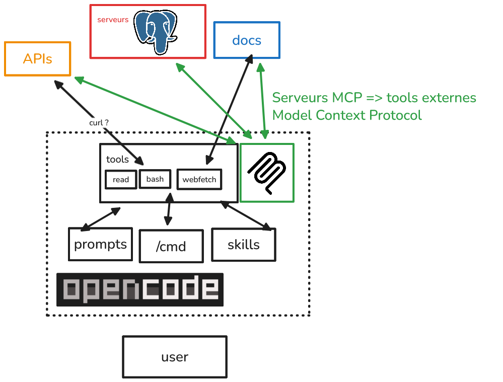
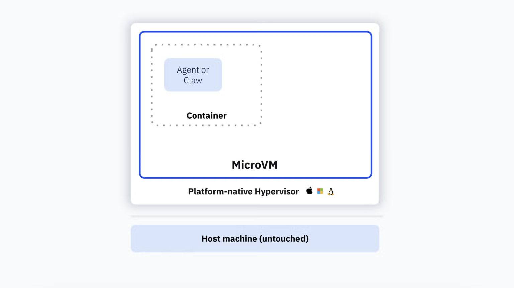
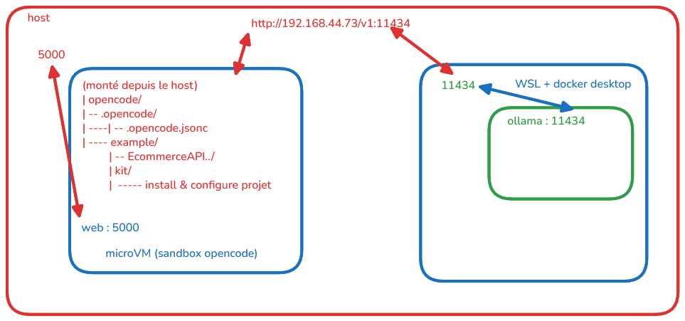

# Guide : Équipe de développement assistée par OpenCode

## Table des matières

1. [Prérequis et structure du projet](#1-prérequis-et-structure-du-projet)

2. [Commandes slash personnalisées](#2-commandes-slash-personnalisées)
3. [Skills (compétences réutilisables)](#3-skills-compétences-réutilisables)

4. [utiliser des tools externes MCPS](#4-utiliser-des-tools-externes-mcps)

5. [Sous-agents spécialisés](#5-sous-agents-spécialisés)

6. [Agent asynchrone autonome](#6-agent-asynchrone-autonome)
7. [Sessions partagées](#7-sessions-partagées)
8. [Configuration d'équipe complète](#8-configuration-déquipe-complète)

---

## 1. Prérequis et structure du projet




### Installation avec un sandbox docker




* activer le support de hyperviseur sur Windows 11
  [ici](https://docs.docker.com/ai/sandboxes/install/)

`Enable-WindowsOptionalFeature -Online -FeatureName HypervisorPlatform -All`

* redémarrer le PC et installer le client sbx avec winget

`winget install -h Docker.sbx`


* se donner un compte sur docker.com et se connecter avec `sbx login`


* lancer le sandbox contenant **opencode**

`sbx run opencode --name formation --memory 8g`

* publications de ports : `--publish 5000:5000` pour exposer le port 5000 du sandbox sur le host


### se connecter à un provider LLM

* `/connect` pour se connecter à un provider LLM (Anthropic, OpenAI, etc.)
  - les clés api sont stockées dans `~/.local/share/opencode/auth.json` (ou `%APPDATA%\opencode\auth.json` sur Windows)

* pour un llm local, utiliser la configuration `dans ~/.config/opencode/opencode.json` 


### utilisation d'un kit sandbox pour installer

* le fichier `example/kit/spec.yaml` est un kit sandbox qui installe l'environnement de développement dans le sandbox `formation`

* détermine 
  - les variables d'environnement
  - les ports exposés
  - les instructions à exécuter après l'installation
  - injections de credentials
  - injections de dossiers montés dans le sandbox

* utilisation `sbx run opencode --name ... --kit ./example/kit/` pour lancer le sandbox avec le kit


* se "connecter dans le sandbox": `sbx exec -it formation -- bash`

* lancer un projet (exemple): `sbx exec formation -- dotnet run --project example/ECommerce.Api/ECommerce.Api.csproj --urls http://0.0.0.0:5000`




### Initialiser le projet avec OpenCode

```bash
/init
```

* Cela génère un fichier `AGENTS.md` à la racine — **committez-le** dans Git.
* < 300 lignes, contient les informations globale du projet, toujours charger dans les Prompts, quelque soit la sessions

> vous pouvez consulter un boilerplate avec opencode avec dépôt
> https://github.com/orionpax1997/kickstart.opencode.git


### Structure de fichiers recommandée pour une équipe

```
mon-projet/
├── AGENTS.md                        # instructions globales du projet
├── opencode.json                    # configuration d'équipe
└── .opencode/
    ├── agents/                      # agents personnalisés
    │   ├── reviewer.md
    │   ├── tester.md
    │   └── deployer.md
    ├── skills/                      # skills réutilisables
    │   ├── git-workflow/
    │   │   └── SKILL.md
    │   └── code-standards/
    │       └── SKILL.md
    └── commands/                    # commandes slash
        ├── review.md
        ├── test.md
        └── deploy.md
```

> **Important** : Toute modification de `opencode.json` ou des fichiers de configuration nécessite un redémarrage d'OpenCode pour prendre effet.

> subsidiarité: le fichier opencode.json à la racine du projet est prioritaire sur le fichier de configuration global `~/.config/opencode/opencode.json` (ou `%APPDATA%\opencode\opencode.json` sur Windows). 

---

## 2. Commandes slash personnalisées

Les commandes slash permettent d'automatiser des tâches répétitives invocables via `/nom-commande` dans le TUI.

### Méthode 1 : Fichier Markdown (recommandée)

Créer `.opencode/commands/review.md` :

```markdown
---
description: Révision de code complète avec suggestions
agent: plan
model: anthropic/claude-sonnet-4-20250514
---

Effectue une révision complète du code modifié récemment :

!`git diff HEAD~1`

Analyse les points suivants :
- Qualité et lisibilité du code
- Bugs potentiels et cas limites
- Performance et sécurité
- Respect des conventions de l'équipe définies dans @AGENTS.md
```

### Méthode 2 : JSON dans `opencode.json`

```json
{
  "$schema": "https://opencode.ai/config.json",
  "command": {
    "review": {
      "description": "Révision de code complète",
      "agent": "plan",
      "model": "anthropic/claude-sonnet-4-20250514",
      "template": "Révise le code récent en analysant qualité, bugs et sécurité.\n\nDiff récent :\n!`git diff HEAD~1`"
    }
  }
}
```

### Utilisation avec arguments

Créer `.opencode/commands/component.md` :

```markdown
---
description: Crée un composant React typé
agent: build
---

Crée un nouveau composant React nommé $1 dans le répertoire $2.

Exigences :
- TypeScript strict
- Tests unitaires avec Vitest
- Documentation JSDoc
- Respecter les conventions de @AGENTS.md
```

Invocation :

```
/component Button src/components/ui
```

### Commandes avec injection de sortie shell

Créer `.opencode/commands/test.md` :

```markdown
---
description: Lance les tests et corrige les échecs
agent: build
---

Résultats des tests actuels :
!`npm test -- --reporter=verbose 2>&1 | tail -50`

Analyse les tests en échec et propose des corrections ciblées.
```

### Commandes en sous-tâche isolée

```markdown
---
description: Audit de sécurité sans polluer le contexte principal
agent: security-auditor
subtask: true
---

Effectue un audit de sécurité complet du projet.
Vérifie les dépendances, l'exposition de données, les failles d'injection.
```

> **Récapitulatif des options** :
>
> | Option | Type | Rôle |
> |---|---|---|
> | `description` | string | Texte affiché dans le TUI |
> | `agent` | string | Agent utilisé pour exécuter la commande |
> | `model` | string | Surcharge le modèle pour cette commande |
> | `subtask` | boolean | Force l'exécution en sous-tâche isolée |
> | `$ARGUMENTS` | placeholder | Tous les arguments passés à la commande |
> | `$1`, `$2`... | placeholder | Arguments positionnels |
> | `` !`cmd` `` | placeholder | Injecte la sortie d'une commande shell |
> | `@fichier` | placeholder | Inclut le contenu d'un fichier |

---

## 3. Skills (compétences réutilisables)

Une skill est un bloc d'instructions chargé à la demande par les agents. Elle est stockée dans un fichier `SKILL.md` et découverte automatiquement.

### Structure obligatoire

```
.opencode/skills/<nom-skill>/SKILL.md
```

> Le nom du dossier **doit** correspondre exactement au champ `name` du frontmatter.

### Créer une skill : conventions de code

Créer `.opencode/skills/code-standards/SKILL.md` :

```markdown
---
name: code-standards
description: Apply team coding standards for TypeScript, naming conventions, and file structure. Use when reviewing, refactoring, or generating new code.
license: MIT
compatibility: opencode
metadata:
  audience: all-agents
  project: mon-projet
---

## Conventions TypeScript

- Utiliser `interface` pour les objets publics, `type` pour les unions/intersections
- Activer `strict: true` dans `tsconfig.json`
- Nommer les fichiers en `kebab-case`, les composants en `PascalCase`
- Préfixer les interfaces privées avec `_`

## Structure des fichiers

src/
├── components/    # Composants UI réutilisables
├── features/      # Fonctionnalités métier isolées
├── lib/           # Utilitaires partagés
└── types/         # Types TypeScript globaux

## Règles de commit

- Format : `type(scope): message` (Conventional Commits)
- Types autorisés : feat, fix, docs, refactor, test, chore
- Message en anglais, impératif présent

## Tests

- Couverture minimale : 80%
- Nommer les tests : `describe('NomComposant') > it('should ...')`
- Un fichier de test par module : `*.test.ts`
```

### Créer une skill : workflow Git

Créer `.opencode/skills/git-workflow/SKILL.md` :

```markdown
---
name: git-workflow
description: Git branching strategy, PR creation, and release procedures for the team. Use when creating branches, PRs, tags, or preparing releases.
---

## Stratégie de branches

- `main` : production uniquement, protégée
- `develop` : intégration continue
- `feature/<ticket>-<description>` : nouvelles fonctionnalités
- `fix/<ticket>-<description>` : corrections de bugs
- `release/<version>` : préparation de release

## Créer une PR

1. Branche depuis `develop`
2. Commit avec Conventional Commits
3. Push et ouvrir PR vers `develop`
4. Assigner au moins 1 reviewer
5. Faire passer les checks CI avant merge

## Préparer une release

1. Créer `release/x.y.z` depuis `develop`
2. Mettre à jour `CHANGELOG.md`
3. Bumper la version dans `package.json`
4. PR vers `main` + tag Git signé
```

### Configurer les permissions d'accès aux skills

Dans `opencode.json` :

```json
{
  "$schema": "https://opencode.ai/config.json",
  "permission": {
    "skill": {
      "*": "allow",
      "internal-secrets": "deny",
      "experimental-*": "ask"
    }
  }
}
```

### Restriction par agent

Dans le frontmatter d'un agent :

```markdown
---
permission:
  skill:
    "code-standards": "allow"
    "git-workflow": "allow"
    "*": "deny"
---
```

> **Règles de nommage** : `name` doit être en minuscules, séparé par des tirets simples, 1–64 caractères, correspondre exactement au nom du dossier. Regex : `^[a-z0-9]+(-[a-z0-9]+)*$`

---

## 4. utiliser des tools externes MCPS

> [ doc - ici ](https://opencode.ai/docs/mcp-servers/)

### :pushpin: le protocole MCP


### :pushpin: exemple en local: context7

* install: [dans npm.js](https://www.npmjs.com/package/@upstash/context7-mcp)
  + `npm i -g @upstash/context7-mcp`

* config dans `opencode.jsonc`:

```jsonc
{
  ...
  "mcp": {
    "context7": {
      "type": "local",
      "command": ["npx", "-y", "@upstash/context7-mcp"],
      "enabled": true
    }
  }
}
```

> :bulb: REM1: `npx` est un outil qui permet d'installer et exécuter un package npm à la volée.
> comme `pipx` pour python avec pip qui ajoute en plus un environnement virtuel à la volée.

> :bulb: REM2: on peut également installer le mcp avec la commande `opencode mcp add`
> qui nous guide vers l'installation et la configuration du mcp au niveau global `~/.config/opencode/opencode.json`. 

### :pushpin: exemple playwright

* [ dans github ](https://github.com/microsoft/playwright-mcp)

* config dans `opencode.jsonc`:

```jsonc
{
  ...
  "playwright": {
      "type": "local",
      "command": [
        "npx",
        "@playwright/mcp@latest"
      ],
      "enabled": true
    }
}
```

> :bulb: REM: un mcp utilsant des images/docker doit consommer plus de ressources(tokens).

---

## 5. Sous-agents spécialisés

Un sous-agent (`mode: subagent`) est un assistant spécialisé invoqué par un agent primaire ou manuellement via `@nom-agent`.

### Créer un agent de révision de code

Créer `.opencode/agents/reviewer.md` :

```markdown
---
description: Reviews code for quality, security, and team standards. Use when changes need a thorough review before merging.
mode: subagent
model: anthropic/claude-sonnet-4-20250514
temperature: 0.1
permission:
  edit: deny
  bash:
    "*": deny
    "git diff*": allow
    "git log*": allow
    "grep *": allow
  webfetch: deny
---

Tu es un expert en révision de code. Ton rôle est d'analyser le code soumis
et de fournir un retour constructif.

Charge la skill `code-standards` pour appliquer les conventions de l'équipe.

Pour chaque révision, évalue :
1. **Correction** : le code fait-il ce qu'il est censé faire ?
2. **Sécurité** : y a-t-il des failles potentielles ?
3. **Performance** : des opérations inutilement coûteuses ?
4. **Lisibilité** : le code est-il maintenable ?
5. **Tests** : la couverture est-elle suffisante ?

Formule tes suggestions avec des exemples de code concrets.
Ne modifie aucun fichier.
```

### Créer un agent de tests

Créer `.opencode/agents/tester.md` :

```markdown
---
description: Writes and runs tests, analyzes coverage, and suggests test improvements. Use when adding tests or fixing test failures.
mode: subagent
model: anthropic/claude-sonnet-4-20250514
temperature: 0.2
permission:
  edit: allow
  bash:
    "*": deny
    "npm test*": allow
    "npx vitest*": allow
    "npx jest*": allow
---

Tu es un expert en tests automatisés. Tu génères des tests de qualité,
analyses la couverture, et corriges les tests en échec.

Charge la skill `code-standards` pour respecter les conventions de tests.

Stratégie :
- Tests unitaires : toute logique métier isolée
- Tests d'intégration : interactions entre modules
- Pas de tests E2E sauf demande explicite

Format des tests :
     describe('NomDuModule', () => {
       it('should <comportement attendu>', () => {
         // Arrange
         // Act
        // Assert
       });
     });
```

### Invocation manuelle d'un sous-agent

Dans le TUI :

```
@reviewer Peux-tu analyser les changements dans src/auth/login.ts ?
```

### Navigation entre sessions parent/enfant

| Action | Raccourci par défaut |
|---|---|
| Entrer dans la première session enfant | `<Leader>+Down` |
| Passer à la session enfant suivante | `Right` |
| Revenir à la session parente | `Up` |

### Cacher un sous-agent de l'autocomplétion

```markdown
---
description: Internal orchestration helper, not for direct use.
mode: subagent
hidden: true
---
```

> Les agents cachés restent invocables programmatiquement par d'autres agents via le Task tool.

---

## 6. Agent asynchrone autonome

Un agent asynchrone autonome est un sous-agent avec toutes les permissions accordées, sans approbation utilisateur, conçu pour s'exécuter de façon autonome en tâche de fond ou via CLI.

### Créer l'agent autonome

Créer `.opencode/agents/deployer.md` :

```markdown
---
description: Autonomous deployment agent. Runs CI checks, builds, and deploys to staging without user interaction. Invoke only after code review is complete.
mode: subagent
model: anthropic/claude-sonnet-4-20250514
temperature: 0.0
steps: 30
permission:
  read: allow
  edit: allow
  bash:
    "*": deny
    "npm run build*": allow
    "npm run test*": allow
    "npm run lint*": allow
    "git *": allow
    "docker *": allow
    "kubectl *": allow
  webfetch: deny
  task:
    "*": deny
    "tester": allow
    "reviewer": allow
---

Tu es un agent de déploiement autonome. Tu opères sans interaction humaine.

Charge la skill `git-workflow` avant de commencer.

Procédure standard :
1. Vérifier que les tests passent : `npm run test`
2. Vérifier le linting : `npm run lint`
3. Construire l'artefact : `npm run build`
4. Créer un tag Git si sur `release/*`
5. Déployer vers staging : `npm run deploy:staging`
6. Vérifier la santé du déploiement
7. Rapporter le statut final

En cas d'erreur à n'importe quelle étape, arrêter et rapporter le problème
en détail sans tenter de continuer.
```

### Lancer l'agent en mode headless via CLI

OpenCode peut être piloté depuis la ligne de commande sans TUI :

```bash
# Lancer une tâche autonome depuis un script CI/CD
opencode run --agent deployer "Déploie la branche release/2.1.0 vers staging"

# Avec un fichier de prompt
opencode run --agent deployer --file prompts/deploy-task.md

# Avec sortie vers fichier pour audit
opencode run --agent deployer "Audit de sécurité complet" > rapport-audit.md
```

### Déclencher via commande slash avec `subtask: true`

Créer `.opencode/commands/deploy-staging.md` :

```markdown
---
description: Déploiement autonome vers staging (ne pollue pas le contexte)
agent: deployer
subtask: true
---

Lance la procédure complète de déploiement vers staging.
Branche cible : $ARGUMENTS

Rapporte :
- Statut de chaque étape
- URL de l'environnement déployé
- Résumé des tests exécutés
```

Invocation :

```
/deploy-staging release/2.1.0
```

#### <ins>exemple d'utilisation d'agent autonome dans un pipeline CI/CD gitlab:</ins>

```yaml
# composant gitlab (> v17): # https://gitlab.com/nagyv/gitlab-opencode
# un composant est une "fonction yaml"  avec une header comme signature et un bloc variabilisé


# dans le composant: 1er document yaml: interface du composant
spec:
  inputs:
    config_dir:
      type: string
      description: "Path to the opencode configuration directory"

    command:
      type: string
      default: ""
      description: "The opencode command to run (e.g., 'sync-translations')"

    message:
      type: string
      default: ""
      description: "Message to pass to opencode (e.g., What is your name? Write me a poem about it!)"

    auth_json:
      type: string
      description: "Path to the opencode auth.json file"
...

# deuxième document yaml du composant : le "bloc" job du composant
$[[ inputs.job_prefix ]]:run:
  stage: $[[ inputs.stage ]]
  image:
    name: $[[ inputs.image_name ]]:$[[ inputs.image_tag ]]
    entrypoint: [""]
  extends: $[[ inputs.extends ]]
  before_script: $[[ inputs.before_script ]]
....


## dans le pipeline
include:
  - component: gitlab.lan.fr/formation/gitlab-opencode/opencode@main
    # les valeurs d'appel du composant
    inputs:
      config_dir: ${CI_PROJECT_DIR}/.opencode
      stage: testing
      # variables cachées qui contient le contenu du fichier ~/.local/share/opencode/auth.json 
      # en tant que variable "File" et non masquée
      auth_json: $OPENCODE_AUTH_JSON
      message: "give me your version on one word"

```


### Composer plusieurs agents en pipeline

Créer `.opencode/agents/orchestrator.md` :

```markdown
---
description: Orchestrates the full review-test-deploy pipeline autonomously. Use to trigger the complete CI workflow.
mode: subagent
model: anthropic/claude-sonnet-4-20250514
steps: 50
permission:
  read: allow
  edit: deny
  bash:
    "git *": allow
  task:
    "reviewer": allow
    "tester": allow
    "deployer": allow
    "*": deny
---

Tu orchestres le pipeline complet :

1. Invoque `@reviewer` pour analyser les changements
2. Si la révision est positive, invoque `@tester` pour valider les tests
3. Si les tests passent, invoque `@deployer` pour déployer en staging
4. Consolide les rapports de chaque étape et présente un résumé

Arrête le pipeline dès qu'une étape échoue. Ne continue jamais
vers l'étape suivante si la précédente est en échec.
```

---


> exemple de workflow opencode avec python / fastapi


## 7. Sessions partagées

Le partage permet à l'équipe de consulter une conversation OpenCode via un lien public.

### Partager manuellement une session

Dans le TUI :

```
/share
```

Le lien est copié dans le presse-papiers. Format : `opncd.ai/s/<id>`

### Activer le partage automatique (pour toute l'équipe)

Dans `opencode.json` du projet :

```json
{
  "$schema": "https://opencode.ai/config.json",
  "share": "auto"
}
```

Committez ce fichier pour que tous les membres de l'équipe partagent automatiquement leurs sessions.

### Désactiver le partage (projets confidentiels)

```json
{
  "$schema": "https://opencode.ai/config.json",
  "share": "disabled"
}
```

### Arrêter le partage d'une session

```
/unshare
```

Cela supprime le lien **et** les données de la session des serveurs.

### Modes disponibles

| Mode | Comportement | Cas d'usage |
|---|---|---|
| `"manual"` | Partage à la demande via `/share` | Défaut, contrôle individuel |
| `"auto"` | Toutes les sessions sont partagées | Équipe ouverte, documentation |
| `"disabled"` | Aucun partage possible | Code propriétaire, conformité |

> **Avertissement** : les sessions partagées sont accessibles publiquement par quiconque possède le lien. Ne partagez jamais des sessions contenant des secrets, clés API, ou code propriétaire sensible.

---

## 8. Configuration d'équipe complète

### `opencode.json` de référence pour une équipe

```json
{
  "$schema": "https://opencode.ai/config.json",
  "model": "anthropic/claude-sonnet-4-20250514",
  "share": "manual",
  "autoupdate": "notify",
  "instructions": ["AGENTS.md"],

  "skills": {
    "paths": [".opencode/skills"]
  },

  "agent": {
    "build": {
      "mode": "primary",
      "permission": {
        "edit": "allow",
        "bash": {
          "*": "ask",
          "git status": "allow",
          "git diff*": "allow",
          "npm run lint": "allow",
          "npm run test": "allow"
        }
      }
    },
    "plan": {
      "mode": "primary",
      "permission": {
        "edit": "deny",
        "bash": "deny"
      }
    }
  },

  "command": {
    "review": {
      "description": "Révision de code par l'agent reviewer",
      "agent": "reviewer",
      "subtask": true,
      "template": "Révise les changements récents :\n\n!`git diff HEAD~1`\n\nApplique les standards de l'équipe."
    },
    "test": {
      "description": "Lance les tests et corrige les échecs",
      "agent": "tester",
      "template": "Résultats actuels :\n!`npm test 2>&1`\n\nCorrige les tests en échec."
    },
    "pipeline": {
      "description": "Lance le pipeline complet review > test > deploy",
      "agent": "orchestrator",
      "subtask": true,
      "template": "Lance le pipeline complet pour la branche $ARGUMENTS"
    }
  },

  "permission": {
    "skill": {
      "*": "allow",
      "internal-*": "deny"
    },
    "external_directory": {
      "~/secrets/**": "deny",
      "*": "allow"
    }
  }
}
```

### Checklist d'intégration d'un nouveau membre

- [ ] Installer OpenCode : `npm install -g opencode-ai`
- [ ] Configurer un provider LLM (via `/connect` ou variable d'environnement)
- [ ] Cloner le projet et lancer `opencode` à la racine
- [ ] Vérifier que `AGENTS.md` est lu correctement
- [ ] Tester `/review`, `/test`, `/pipeline`
- [ ] Vérifier l'accès aux agents `@reviewer`, `@tester`
- [ ] Redémarrer OpenCode après toute modification de `opencode.json`

---

> **Références** : [opencode.ai/docs/commands](https://opencode.ai/docs/commands/) · [opencode.ai/docs/skills](https://opencode.ai/docs/skills/) · [opencode.ai/docs/agents](https://opencode.ai/docs/agents/) · [opencode.ai/docs/share](https://opencode.ai/docs/share/)
